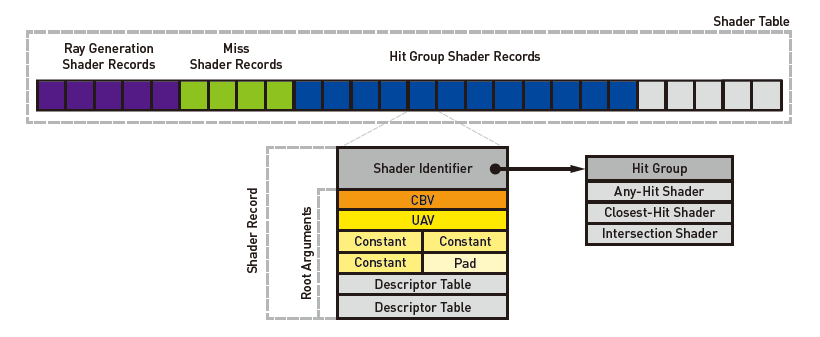

### 材质表

&nbsp;&nbsp;&nbsp;&nbsp;着色器表是64位对齐GPU内存的连续块，包含光线跟踪着色器数据和场景资源绑定。如图3-3所示，着色器表格中充满了着色器记录。着色器记录包含一个惟一的着色器标识符和由着色器的本地根签名定义的根参数。着色器标识符是由RTPSO生成的32位数据块，充当指向着色器或hit组的指针。因为着色器表只是GPU内存拥有和通过应用程序的直接修改，它们的布局和组织非常灵活。因此，图3-3所示的组织只是着色器表中记录的许多排列方式之一。&nbsp;&nbsp;



​    **图3-3:** DXR着色器表及其着色器记录的可视化. 着色器记录包含材质着色器唯一标识和根参数用于查找资源.


&nbsp;&nbsp;&nbsp;&nbsp;当在ray遍历期间生成着色器时，将查询着色器表并读取着色器记录来定位着色器代码和资源。例如，如果一条射线在遍历加速结构后丢失了所有几何图形，DirectX使用着色器表来定位要调用的着色器。对于miss着色器，索引计算为第一个miss着色器的地址加上着色器记录步长乘以miss着色器索引。它被写成 

​                                                            **&M[0] + ( sizeof( M[0] ) x I~miss~  )**                                    [1]

在HLSL中，miss着色器索引 I~miss~作为参数提供给**TraceRay()**。

当为一个命中组选择着色器记录时(例如交叉着色器、近景着色器和任意着色器的组合），则计算更为复杂:

​                                  **&H[0] + ( sizeof(H[0]) x ( I~ray~ + G~mult~ + G~id~ + I~offset~ ))**                           [2]

在这里，I~ray~表示一个ray类型，并被指定为 **TraceRay()** 的一部分。您可以在BVH中为不同的基元使用不同的着色器:G~id~是一个内部定义的几何标识符，根据底层加速结构中的基元顺序定义;G~mult~指定为 **TraceRay()** 的参数，在简单的情况下表示射线类型的数量;I~offset~是在顶层加速结构中定义的每个实例的偏移量。&nbsp;&nbsp;

&nbsp;&nbsp;&nbsp;&nbsp;要创建着色器表，请预留GPU内存并填充着色器记录。下面的示例为三条记录分配了空间:即射线生成着色器及其本地数据、未命中着色器和包含本地数据的命中组。当向表写入着色器记录时，使用**ID3D12StateObjectProperties**对象的GetShaderIdentifier()方法查询着色器的标识符。使用RTPSO创建期间指定的着色器名称作为检索着色器标识符的键。&nbsp;&nbsp;

```c
# define TO_DESC(x)(*reinterpret_cast<D3D12_GPU_DESCRIPTOR_HANDLE*>(x))
ID3D12Resource* shdrTable;
ID3D12DescriptorHeap* heap;

// 复制着色器记录到着色器表GPU缓冲区。
uint8_t* pData;
HRESULT hr = shdrTable->Map(0, nullptr, (void**)&pData);

// [ Shader Record 0]
// 设置光线生成着色器标识符。
memcpy (pData, rtpsoInfo->GetShaderIdentifier(L"Unqiue_RGS_Name"));

// 从本地根签名设置光线生成着色器的数据。
TO_DESC(pData + 32) = heap->GetGPUDescriptorHandleForHeapStart();

// [Shader Record 1]
// 设置miss着色器标识符(不设置本地根参数)。
pData += shaderRecordSize;
memcpy(pData, rtpsoInfo->GetShaderIdentifier(L"Unqiue_Miss_Name"));

// [Shader Record 2]
// 设置最近命中的着色器标识符。
pData += shaderRecordSize;
memcpy(pData, rtpsoInfo->GetShaderIdentifier(L"HitGroup_Name"));

// 从本地根签名设置命中组的数据。
TO_DESC(pData + 32) = heap->GetGPUDescriptorHandleForHeapStart();

shdrTable->Unmap(0, nullptr);
```

&nbsp;&nbsp;&nbsp;&nbsp;着色器表存储在应用程序拥有的GPU内存中，这提供了很大的灵活性。例如，根据应用程序的更新策略，可以优化资源和着色器更新，使之尽可能少地触及所需的着色器记录，甚至可以双缓存或三缓存。&nbsp;&nbsp;

