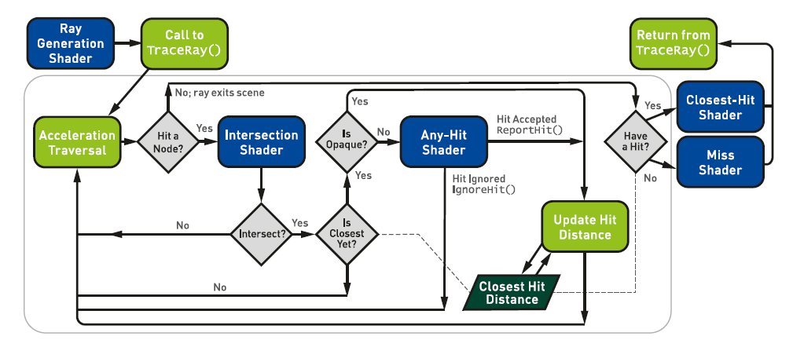
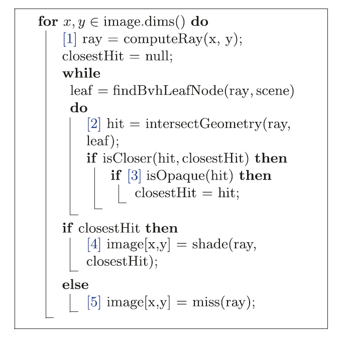

传统的GPU光栅管道包含许多可编程的阶段，开发人员编写自定义着色器代码来控制生成的图像。DirectX射线跟踪引入了一个新的射线原语和灵活的per-ray数据存储(参见3.5.1节)，以及五个新的着色器阶段，如图3-2中简化的管道图所示。这些着色器可以发射光线，控制光线/几何交叉点，并对识别的命中物体进行着色.

>1.射线生成着色器启动管道，允许开发人员使用新的内置TraceRay()着色器函数指定要启动哪些射线。与传统的计算着色器类似，它在常规的一、二或三维样本网格上执行。

>
图3 - 2。一个新的DirectX射线跟踪管道的简化视图，包括五个新的着色器阶段(蓝色):光线生成、相交、任意命中、最近命中和未命中着色器。这种复杂性发生在遍历循环中(图中大部分是大的灰色轮廓线)，其中射线针对包围体节点进行测试，并确定潜在命中，并按顺序确定最近的命中。没有显示来自最近命中和未命中着色器对TraceRay()的潜在递归调用。

>2.交集着色器定义使用任意原语的光线交集的计算。为光线/三角形交叉口提供了高性能默认值。

>3.任何命中着色器（shaders[^1]）都允许控制地丢弃其他有效的交叉，例如，在纹理查找之后忽略透明遮罩的几何图形。

>4.一个最接近的着色器沿着每条射线在最近的一个交点执行。通常，这在交点计算颜色，类似于光栅管道中的像素着色器。

>5.当光线错过场景中的所有几何图形时，就会执行miss着色器。例如，这允许查找环境映射或动态天窗模型。

考虑下面的伪代码，它是一个简单的CPU射线跟踪器，您可以在入门教材[9]中找到它。代码在输出图像上循环，计算每条射线的方向，遍历加速结构，在重叠的加速结构节点中交叉几何图形，查询这些交叉是否有效，并为最终结果着色。

[^1]:尽管有这个名字，任何命中着色器都不会在每个交集运行一次，主要是出于性能原因。默认情况下，它们可以运行一个变量，每个ray运行的次数与实现相关。仔细阅读规范，以理解和控制更复杂用例的行为。

至少在标准用例中，新的DXR着色器与这个简单射线跟踪器的某些部分是对应的。射线生成着色器的启动大小对应于图像的尺寸。相机计算产生每个像素的射线发生在射线生成着色器中。

当射线遍历包围体层次结构时，叶子节点中原语的实际交集逻辑上出现在DirectX交集着色器中，并且可以在任意命中的着色器中丢弃检测到的交集。最后，一旦射线完成了对加速结构的遍历，它要么在最近命中的着色器中被着色，要么在未命中的着色器中被赋予默认颜色。