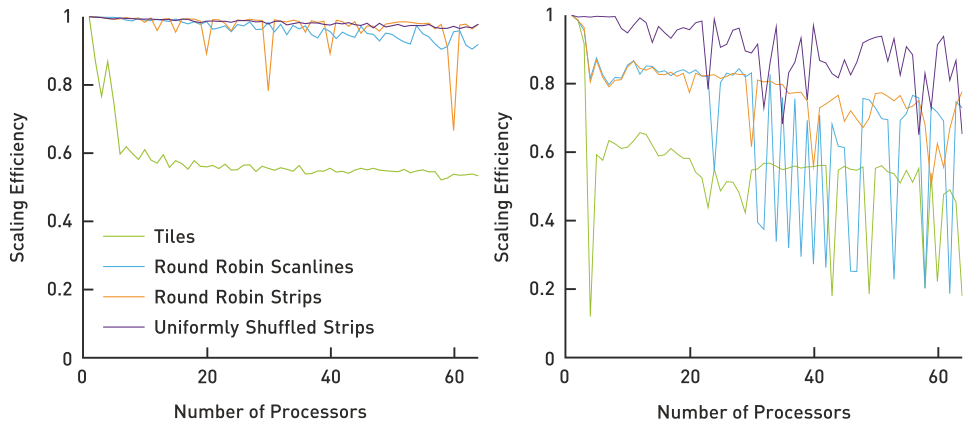

# 10.4 RESULTS
# 10.4 结果

Figure 10-3 illustrates the differences in per-pixel rendering cost of the scene shown in Figure 10-1. The graphs in Figure 10-4 compare the scaling efficiency of contiguous tiles, scanlines, and two types of strip distributions for the same scene. Both strip distributions use the same region size and differ only in their assignment to processors. Uniformly shuffled strips use the distribution approach described in Section 10.3.3.
图 10-3 展示了图 10-1 场景中逐像素渲染开销的差异。图 10-4 比较了对一个场景进行连续的分块、扫描线、以及两种条带分布的扩展效率。两种条带分布使用同样的区域大小，区别仅在于分配给处理器的方式不同。

Figure 10-3. Heat map of the approximate per-pixel cost of the scene shown in Figure 10-1. The palette of the heat map is (from low to high cost) turquoise, green, yellow, orange, red, and white.
图 10-3. 图 10-1 的场景中逐像素开销的近似热度图。热度图的颜色依次为（开销从低到高）：蓝绿、绿、黄、橙、红、白。

扩展效率

分块
轮流分配的扫描线
轮流分配的条带
均匀重排的条带

Figure 10-4. Scaling efficiency of different workload distribution schemes for the scene shown in Figure 10-1. Left: the processors are identical. Right: the processors have different speeds.
图 10-4. 对图 10-1 场景的不同负载分发方案的扩展效率。左：所有处理器完全相同；右：处理器具有不同的速度。

The predominant increase in efficiency shown on the left in Figure 10-4, especially with larger processor counts, is due to finer scheduling granularity. This reduces processor idling due to lack of work. The superior load balancing of the uniformly shuffled strips becomes even more obvious in the common case of heterogeneous computing environments, as illustrated on the right in Figure 10-4.
图 10-4 左图中展示了效率的显著提高，特别是在处理器数目较大的情况下。效率的提高主要是由于更精细的调度粒度减少了处理器由于缺乏工作而导致的空闲时间。均匀重排的条带这一方法展示出了极好的负载均衡，在一般化的异构计算环境中更为明显，如图 10-4 右图所示。

# REFERENCES
# 参考文献

[1] Dietz, H. G. The Aggregate Magic Algorithms. Tech. rep., University of Kentucky, 2018.
http://aggregate.org/MAGIC/

[2] Keller, A., Wächter, C., Raab, M., Seibert, D., van Antwerpen, D., Korndörfer, J., and Kettner, L.
The Iray Light Transport Simulation and Rendering System. arXiv, https://arxiv.org/ abs/1705.01263, 2017.
