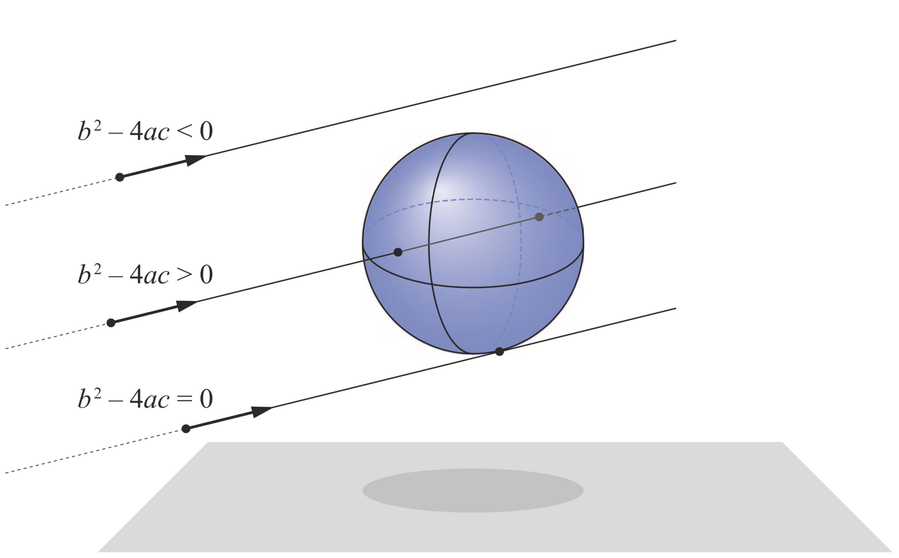
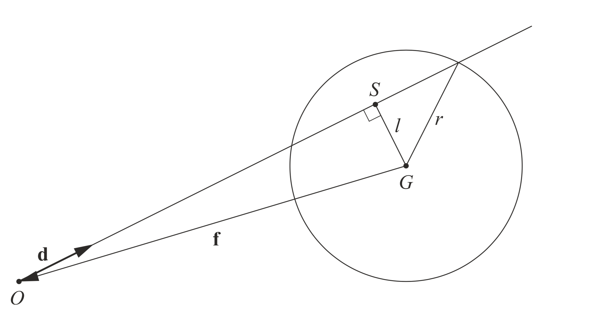
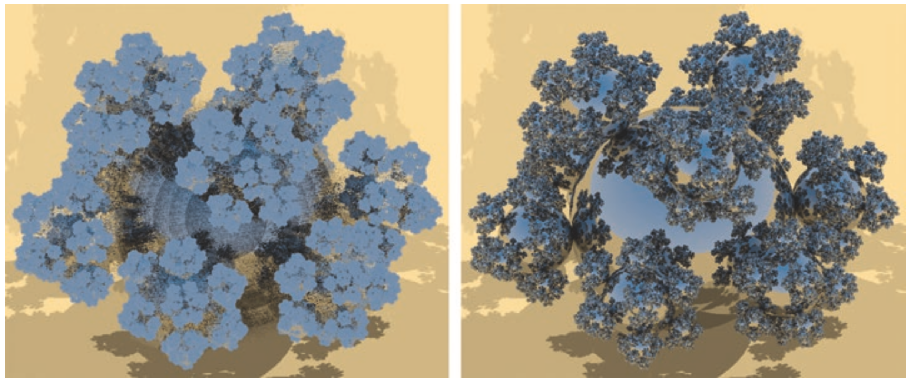

# 第七章：光线/球体相交检测的精度优化

## 摘要
计算光线/球体相交的传统方法是直接解二次方程。
虽然这种因式分解法在数学上是正确的，但是在使用浮点数进行计算时可能会出现数值不稳定性。
本文给出两种不常见的方程解法，并且展示他们对计算精度的优化效果。

## 7.1 光线/球体相交基础
球体是最容易用来光线追踪的物体之一，因此很多早期的光线追踪生成的图片都以球体作为主体。如图 7-1。

 

*图7-1：球形分形雪花场景。地面是一个巨大的球体。场景中有四千八百万个球体，其中大多数要小于一个像素[9]*

任意球体都可以用他的中心坐标 G 和半径 r 来定义。对于此球体表面上的任意点P, 有方程：

(P-G)×(P-G)=r2.     【1】

在求解球体与光线的相交时，上式中的P应被替换成 R(t) = O + t **d**（见第二章）。令 **f** = O - G, 并简化方程，即可得到：

(**d**⋅**d**) t2 + 2(**f**⋅**d**) t + **f**⋅**f** - r2 = at2 + bt + c = 0      【2】

此二次方程的解是

t0,1 = (- b ± b2-4ac) / (2a)     【3】

如果判别式 Δ = b2-4ac < 0, 则光线与球体不相交；
如果Δ = 0，则光线刚好擦过球体表面 （即两个交点重合）；
如果Δ > 0, 那么两个不同的t值则对应着两个不同的交点。如图7-2。

 

*图7-2：光线/球体相交检测。三种不同的情况，从上到下分别为，不相交，两个交点，和单个交点（两个重合的交点）* 

将t值带入光线方程，即可得到两个交点：P0,1 = R(t0,1) = O + t0,1**d**。
在计算出交点（比如P0）之后，这一点的单位法线为

**n** = P0 - G        【4】

## 7.2 浮点数精度问题
浮点数运算很容易出现很大的问题，尤其是是使用32位浮点数来实现式【3】的时候。
这里将给出两种常见情况的补救方法：球体半径相对于到光线起始点的距离非常小（图7-3），光线临近一个巨大的球体（图7-4）。

*图7-3：4个单位球（r=1），距离正交相机的距离从左到右分别是100，200，2000，4100。
直接实现式【3】可能带来严重的浮点数误差，甚至检测不到相交（距离4100的情况）。*

 

*图7-4：二次方程精度问题：使用一个巨大的球体作为地面，
直接求解【左】，和使用Press等人[6]提出的更加稳定的解法【右】，放大后的结果*

为了理解这些误差出现的原因，这里将简单介绍浮点数的一些性质。
除了符号位之外，浮点数被表示为 s × 2e 的形式，其中固定位数的s和e分别表示有效数和幂数。
在进行运算时，较小的浮点数的有效数需要进行右移，因此其最右边的位数将会丢失，所以精度会受损。
单精度浮点数有24个有效数位，所以对于任意一个单精度浮点数，加上一个比它小224 ≈ 107倍的浮点数将不会改变结果。

这个有效数字丢失的问题在计算式【2】中的 c = **f**⋅**f** - r2 时非常显著，
这是由于数字在做减法之前先被平方，也就意味着有效数位减半。
**f**⋅**f** = ‖O-G‖2 是球心到光线起始点的距离的平方，
所以如果球体到 O 的距离大于 212r = 4096r，那么球体半径 r 在相交计算过程中则不会被考虑到。
即使在更短的距离，视觉误差也会出现，因为r的有效数位只剩下很少的几位。见图7-3。

Hearn 和 Baker[3]给出了一个对于小球体数值上更加稳定的解法，并被Sony Pictures Imageworks用作样例[4]。
此解法的思路是重新表示  b2-4ac。
这里使用 **v** ⋅ **v** = ‖**v**‖2 = v2 来表示向量模长, **d**u 表示 **d**的单位向量：

  b2-4ac                                                                                                  
= 4a (b2/(4a) - c)                                                                                        
= 4**d**2 ( (**f** ⋅ **d**)2 / ‖**d**‖2  -  (**f**2-r2) )     
= 4**d**2 ( r2 -  (**f**2 - (**f**⋅**d**u)2  ) )              
= 4**d**2 ( r2 -  (**f** - (**f**⋅ **d**u) **d**u )2 )     【5】

*译者注：这里建议出版打印的时候还是按照原著来，将du 替换成 d加小帽子（下一个自然段中的du也应该替换），见图Formula5*

这里的最后一步比较复杂，通过几何的角度可以更容易地解释。
从球心 G 到光线的垂直距离 *l* 可以通过毕达哥拉斯定理计算，**f**2 = *l*2 + (**f**⋅**d**u)2 ，
或者通过计算 **f** 减去从光线起始点到垂足得到的向量的距离，S = O + (**f**⋅ **d**u) **d**u。见图7-5。
第二种计算方法精度更高，因为向量项在点积之前先做了减法。使用这种方法时，判别式变成 Δ = r2 − *l*2。
在这个减法中，半径r不会丢失有效数位，因为如果发生了相交，则有 r ≥ *l* 。见图7-6。

 

*图7-5：计算l2的不同方法的几何背景。光线起始点 O，球心 G，和球心到光线的投影S，组成一个垂直三角形*

*图7-6：小球体时的精度问题。将照相机与球体雪花的距离相比图7-1增加100倍，并缩小视野。
使用传统二次方程公式得到的结果【左】，和使用Hearn 和 Baker给出的稳定的解法得到的效果【右】*

另外一种精度丢失发生的状况是对两个很接近的数做减法。
这种时候，大部分有效数位互相抵消，只留下很少的几个有意义的位。
这种情况通常被称为*灾难性相消*。
在解二次方程的时候，如果 b ≈ √（b2-4ac), 比如光线与一个巨大的球体的交点就在光线起始点附近的时候，灾难性相消就会发生。
Press等人[6]给出了一种更加稳定的求解方法，并被使用在pbrt渲染器和其他系统里面。
这种解法的关键在于灾难性相消只会对二次方程的其中一个解发生，具体哪一个解则由b的符号决定。
我们可以通过使用t0t1 = c/a 来计算更高精度的这个解:

t0 = c/q                                       
t1 = q/a                                       
其中 q = (-1/2) * ( b + sign(b)√(b2-4ac) )      

在这里，sign 是符号函数，如果参数大于 0 则返回 1，否则返回 -1。这种计算方法的效果见图7-4。

这两种增强精度的方法可以一起使用，因为他们之间是相互独立的。
第一个方法计算更加稳定的判别式，第二个方法使用判别式来更好的计算距离。
通过重写b, 解二次方程的过程中可以避免需要使用像"4"这样的常数。
经过精简之后，最终的解法是

a = **d** ⋅ **d**         【7】 
b' = -**f** ⋅ **d**       【8】 
Δ = r2 - (**f** + (b'/a)**d**)2   【9】

其中 Δ 是判别式。如果 Δ 非负，则光线与球体产生交点，并且 b' 和 Δ 可以用来计算距离。
与之前一样，令 c = **f**2 - r2, 并计算 

t0 = c/q   
t1 = q/a   
其中 q = b' + sign(b')√(aΔ)        【10】

如果可以假设光线方向是单位向量的话，则 a = 1 并且求解过程可以继续稍作简化。

如果条件允许，这个算法中还有其他捷径存在。
比如，如果光线起始点在球体外部，则 c 为正，如果光线起始点在球体内部，则 c 为负。
c 的符号可以用于判断相交检测应该返回 t0 还是 t1。
如果 b' 为负，则球体中心在光线的后方，所以如果 c 同时也为正，则光线与球体必定不相交。

因此，并不存在唯一的最好的计算光线/球体相交的方法。
比如，如果已知应用程序不大可能出现相机临近巨大球体的情况，则没有必要使用Press等人提出的算法，因为这样会稍微增加程序的复杂度。

## 7.3 相关资源
本文中提到的解法的代码可以在Github上查看[8]。
光线相交器，比如Shadertoy[7]中的一些着色器，也是研究这些解法的途径。

## 感谢
感谢Stefan Jeschke提出Hearn和Baker的小球体测试，
感谢Chris Wyman和Falcor团队[1]制作的用于渲染球体雪花的框架，
感谢John Stone独立认证了本文的结果。

## 参考文献
[1] Benty, N., Yao, K.-H., Foley, T., Kaplanyan, A. S., Lavelle, C., Wyman, C., and Vijay, A. The Falcor Rendering Framework. https://github.com/NVIDIAGameWorks/Falcor, July 2017.

[2] Haines, E. Essential Ray Tracing Algorithms. In An Introduction to Ray Tracing, A. S. Glassner, Ed. Academic Press Ltd., 1989, pp. 33–77.

[3] Hearn, D. D., and Baker, M. P. Computer Graphics with OpenGL, third ed. Pearson, 2004.

[4] Kulla, C., Conty, A., Stein, C., and Gritz, L. Sony Pictures Imageworks Arnold. ACM Transactions on Graphics 37, 3 (2018), 29:1–29:18.

[5] Pharr, M., Jakob, W., and Humphreys, G. Physically Based Rendering: From Theory to Implementation, third ed. Morgan Kaufmann, 2016.

[6] Press, W. H., Teukolsky, S. A., Vetterling, W. T., and Flannery, B. P. Numerical Recipes: The Art of Scientific Computing, third ed. Cambridge University Press, 2007.

[7] Quílez, I. Intersectors. http://www.iquilezles.org/www/articles/intersectors/ intersectors.htm, 2018.

[8] Wyman, C. A Gentle Introduction to DirectX Raytracing, August 2018. Original code linked from http://cwyman.org/code/dxrTutors/dxr_tutors.md.html; newer code available via https://github.com/NVIDIAGameWorks/GettingStartedWithRTXRayTracing. Last accessed November 12, 2018.

[9] Wyman, C., and Haines, E. Getting Started with RTX Ray Tracing. https://github.com/ NVIDIAGameWorks/GettingStartedWithRTXRayTracing, October 2018.