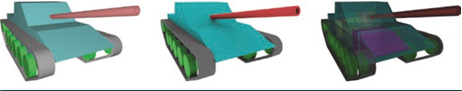

自从50年前引入领域以来, 光线追踪一直被用于解决计算机图形学中的可见性问题。首次命中遍历返回与光线相交的最近基元, 的信息, 如图9.1中左图所示。当使用递归遍历以后, 首次命中得到的信息仍然可以用于汇总视觉效果例如折射, 反射以及各种形式的间接照明。因此, 大多数光线追踪API都着重于优化首次相交的性能。
第二种类型的光线遍历, 任意命中遍历, 也被应用于计算机图形学。对于任意命中光线遍历, 不受限于最近相交的基元, 而是简单地返回指定间隔内是否存在任意与光线发生相交的基元。任意命中光线遍历特别适合用于像阴影和光遮蔽等特效, 如果图9.1中中间的图例所示。
第三种类型的光线遍历, 多重命中光线遍历 [5], 一次相交查询返回一条光线N次最近相交的片元。多重光线遍历既可以只返回首次相交的片元(当 N = 1 时), 也可以返回所有每次相交得到的片元信息(当 N = ∞ 时), 同时也可以是在这两个极端之间的任意值。
多重命中光线遍历在许多计算机应用中都很有用, 比如快速而精确的渲染透明物体。基于光栅化的方案需要在GPU上进行昂贵的片段排序而且必须进行扩展才能够正确的渲染共面物体。相比之下, 多重命中光线遍历提供了一种更直接, 性能更好的的方法来实现重叠共面的透明物体的渲染。
>有如Gribble等同志对同时存在于透明物体的渲染和物理模拟中的共面物体的问题进行了更彻底的讨论[5], 感兴趣的读者可以参考以获得更多细节。

图9-1 三类光线遍历。首次命中遍历和任意命中遍历是计算机图形学应用中常用的算法例如可见性检测(左图), 环境光遮蔽(中图)。我们探索的多重命中光线遍历, 第三类光线遍历算法返回了N次最近相交的基元, (N ≥ 1)。多重命中光线遍历在各种计算机图形学和基于物理的渲染应用中都非常有用, 包括透明渲染等(右图)。

重要的是, 多种命中光线遍历也可广泛用于各种基于物理的模拟, 或是叫做非光学渲染, 如图9-1中右图所示。在诸如弹道穿透, 射频传播, 除此之外还有热辐射传递等受Beer-Lambert Law约束的相关现象上需要光线在每一段间隔上的信息, 而不仅是相交点。这些模拟有些类似于渲染一个所有物件都表现为传播介质行为的场景。
一个正确的多重命中光线遍历算法是很有必要的, 但这还不够, 在许多应用场景中, 性能对于可交互性和保真度也是一大重要保障。现代光线追踪引擎通过高度优化的光线追踪核心把一些复杂性隐藏在简洁, 设计良好的API之后来帮助定位性能需要关心的问题。为了加速光线追踪查询, 这些引擎使用了大量基于用户提供给引擎的应用程序特征简历的边界体积层级结构bounding volume hierarchy(BVH)。为了加速光线查询, 这些引擎通常都提供首次命中和任意命中类型的光线遍历操作给用户在光学和非光学领域中使用, 但它们通常不支持多重命中光线遍历作为基本操作。
多重光线遍历[5]的准备工作是假定一个基于空间划分的加速结构, 他们的叶子节点互不重叠。有了这样的结构, 有序地光线遍历并因此产生有序的命中点是直截了当的：只需要在叶子节点内部排序, 而不需要在节点之间排序。然而在结构中进行有序的光线遍历依赖的物体划分, 例如BVH, 并没有那么容易实现。而基于优先队列(而不是遍历栈)的一个实现能够从前往后地遍历BVH[7], 目前公开可用的, 广泛用于生产的光线追踪API都不提供有序的BVH遍历。
然而这些API, 包括Microsoft DirectX Raytracing (DXR), 公开了完全使用用户级代码实现的多重命中光线追踪特性, 从而利用其现有的经过大量优化的BVH结构和遍历路径。在本章节的之后部分, 我们提出了几种可能使用DXR实现的多重命中光线追踪方法, 并在一个示例程序中探索他们的性能差异。此程序的源代码和二进制分发都有提供[4], 可以让读者自行探索, 修改或是改进这些多重光线追踪实现。