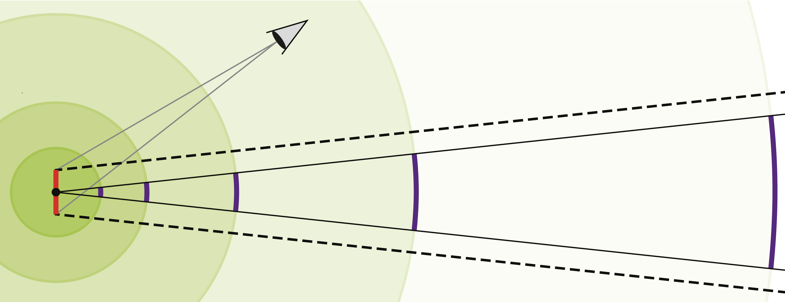

###绪论

环境贴图常用于低开销地表现远景，抑或表示由环境射入的光，然后用它对几何体着色[4]。常见的环境贴图布局有两种，一种是经纬度贴图[2]（latitude-longitude
maps），另一种是立方体贴图[5]（cube maps）。

栅格化以“四像素”的形式出现，即每次2*2像素，因此我们可以用水平和垂直像素差来估算差分结果。这些差分结果可以用来计算细节层级，以便用 Mipmap 执行纹理查找。然而在射线追踪中，“四像素”的概念是不可用的；相反，纹理过滤通常使用射线差分[20]和光锥[1, 3]来完成，这两种方法在第 20 章有介绍。Pharr 等人通过前向差分近似法计算出环境贴图中纹理空间的射线差分，其算法主要部分包括三个向量归一化和调用六个反三角函数。

由于假定环境贴图在无穷远处，使用光栅化的环境贴图仅取决于反射向量的方向分量，而不是反射向量的位置。即使光锥和射线差分也有表示射线的位置分量，但如图 21-1 所示，我们无需使用它们。本章我们提供了用光锥和射线差分计算环境贴图过滤的方法。

图21-1：射线差分和光锥由位置分量（红色）和方向分量（虚线）组成。和往常一样，由于假定环境贴图在无穷远处，不管圆的面积有多大，一个单点（图中黑点）和方向分量（黑实线）对圆的覆盖率相同。而虚线区域对圆的覆盖率则会随着圆的增大而减小。在无穷远处，它对圆的覆盖率会和紫色部分的覆盖率相同。因此，我们只能使用方向分量来访问环境贴图，即便对于光锥和射线差分也如此。

