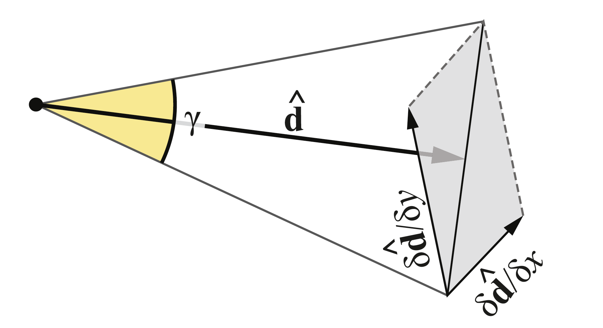

###射线差分

对于射线 $R(t) = O + t\hat{d} $ ，射线差分被定义为

$$\left\{\frac{\partial O}{\partial x},\frac{\partial O}{\partial y},\frac{\partial \hat{d}}{\partial x},\frac{\partial \hat{d}}{\partial y}\right\}, \tag{3}$$

其中 $O$ 为射线原点，$\hat{d}$ 为归一化射线方向（参见第 2 章）。对于射线差分，我们用

$$ \gamma =2\text{arctan}\left(\frac{1}{2}\left |\left |\frac{\partial \hat{d}}{\partial x}+\frac{\partial \hat{d}}{\partial y}\right |\right |\right)\tag{4}$$

来计算扩散角（如图 21-2）。

图 21-2：不考虑射线原点的差异时，扩散角 $\gamma$ 可以用归一化射线方向 $\hat{d}$ 和其差分来计算。

这里的 $\gamma$ 可以用于等式 $(1)$ 和 $(2)$ ，以使用射线差分计算细节层级。

注意，我们的简易方法既不提供各向异性，也不考虑映射可能造成的失真。

