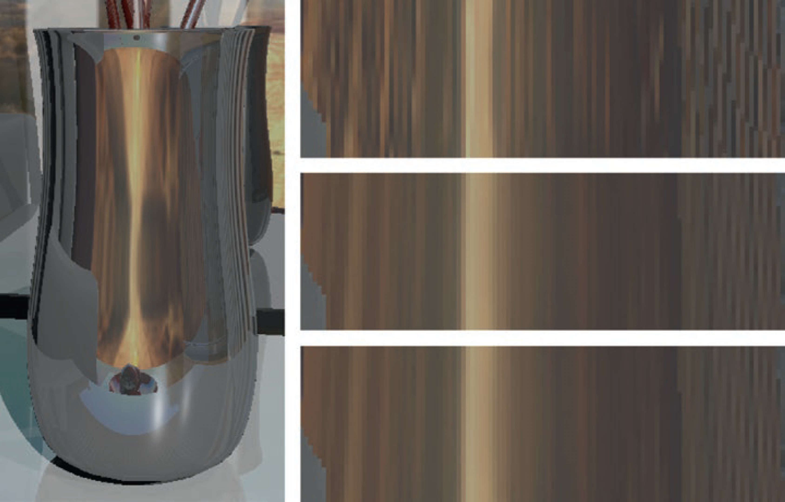

###结果

在对贴图反射的研究中，我们已经习惯在反射中使用纹理过滤。但我们的首个实现没有处理环境贴图，因此，在测试中我们总是使用其它名词替代环境贴图的反射。本章提供了一个解决方案，结果如图 21-3 所示。

图 21-3：使用不同方法处理环境贴图（主要为棕色区域）在花瓶上的夸张反射。右边三张特写由上到下分别表示第 0 层 Mipmap、光锥、光线差分的效果。注意后两张图片是相似的，因为都对环境贴图进行了过滤。在动画中，右上角的图片会出现严重混叠，其它两张则会暂时稳定。
