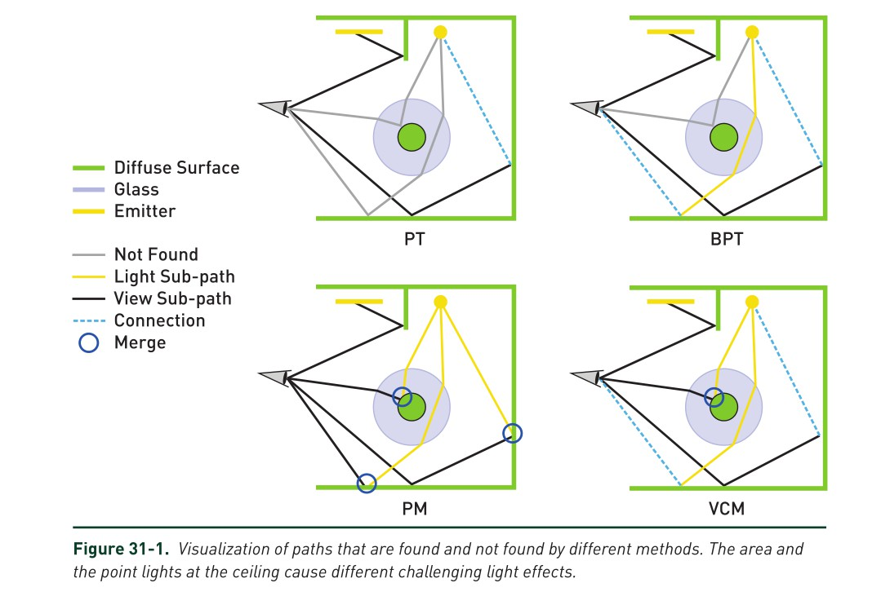
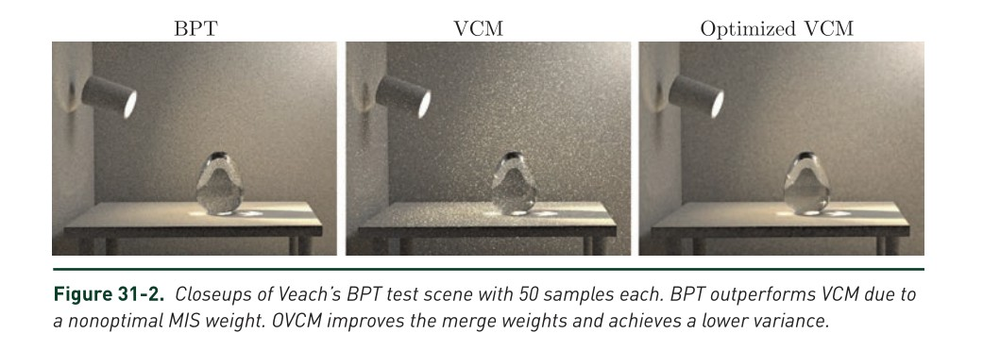
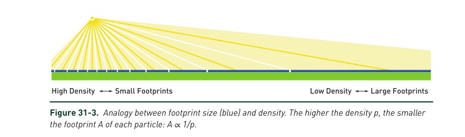
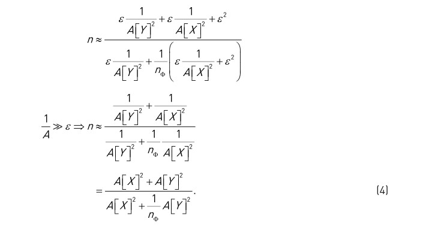
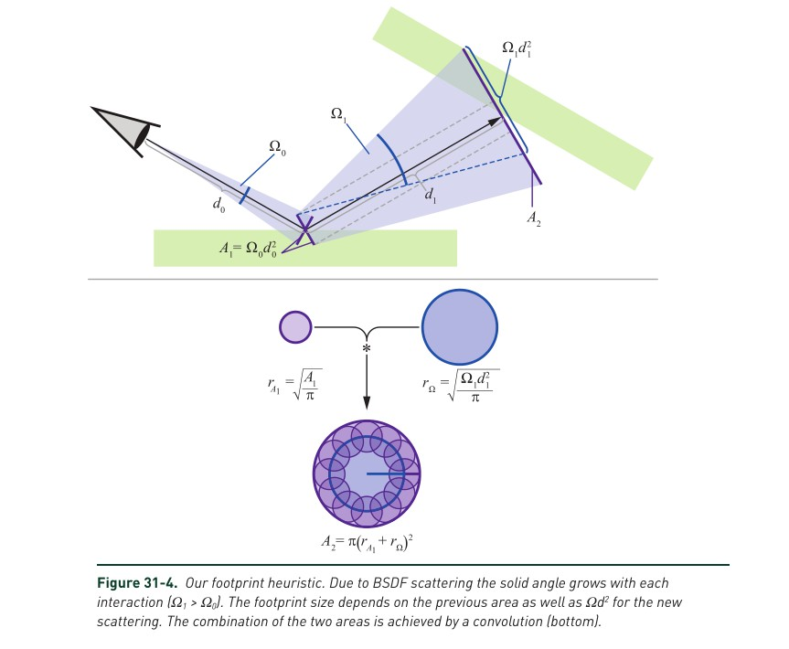
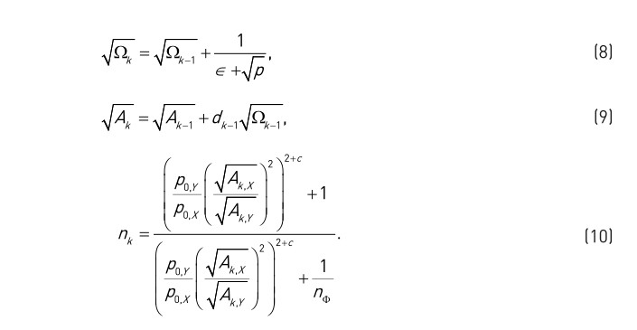
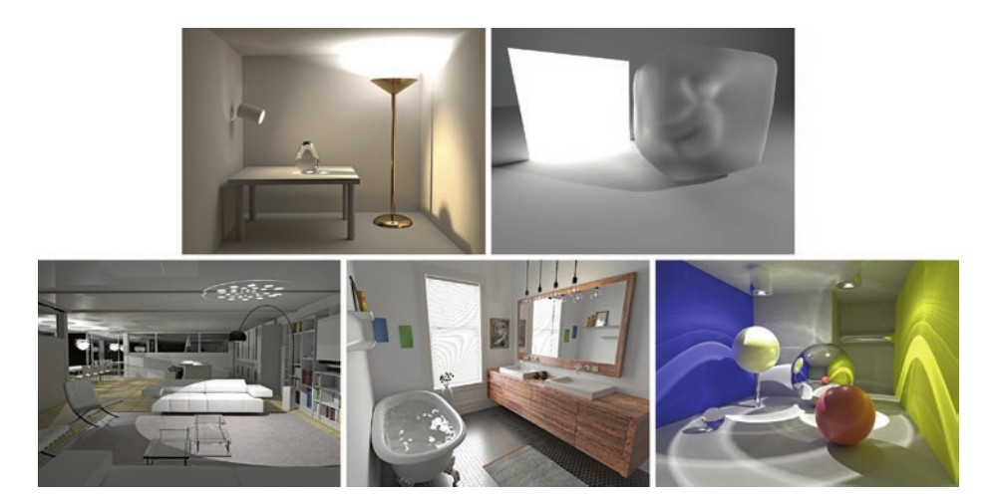
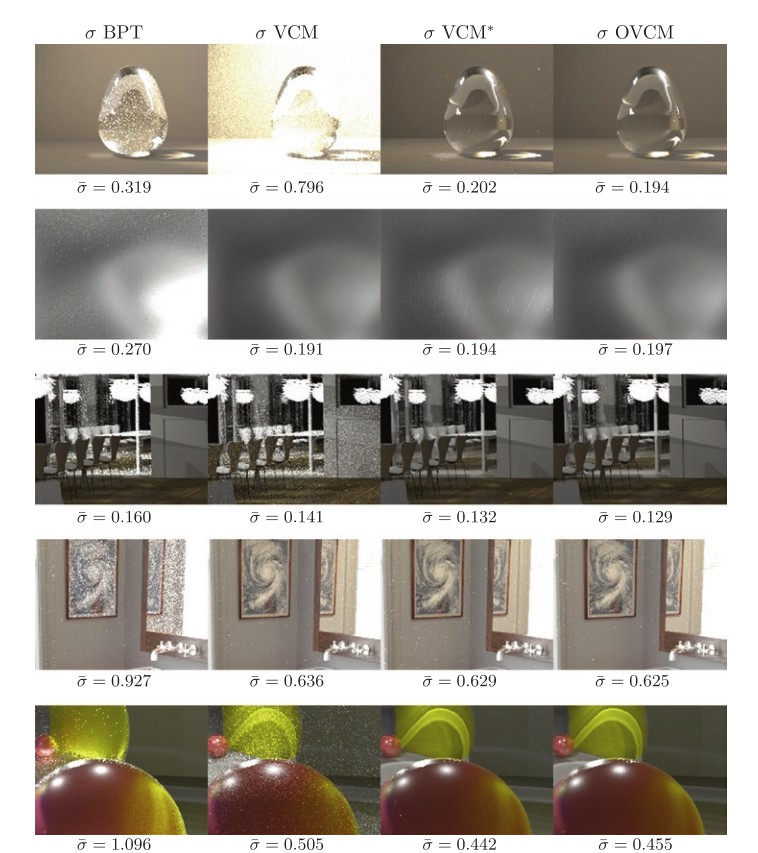

# 31章  在路径重用下使用足迹估计减少方差

## Abstract
多重重要性采样是一个加权不同采样方法结果的工具，其目标是使得采样函数的方差最小。如果应用到光照传输路径中，这种方法使得一些技术，例如双向路径追踪、顶点连接与合并成为可能。第二种技术将路径概率测度推广为合并-也被称为光子映射。不幸的是，由此产生的启发式方法可能会失败，导致噪点明显增加。本章深入探讨了出现问题的原因，并提出了一种简单易用的启发式方法，该方法更接近最优解，并且在不同场景下更可靠。 诀窍是使用子路径的足迹估计来预测通过重用所有光子引入的真实方差减少。

## 31.1 介绍
在光传输模拟中，有许多的采样策略，如图31-1所示。通过跟踪路径，从一个传感器开始，我们可以随机地在场景中找到光源，并通过采样路径计算它们的贡献。此外，下一个事件估计，也就是与已知光源的连接有助于定位较小的光源。这两种采样策略共同构成了Kajiya[8]提出的路径跟踪（PT）算法。在双向路径跟踪（BPT）[9，13]中，随机视线子路径和随机光源子路径之间的所有可能的连接都提供了额外的采样点。BPT可以使用相机连接找到焦散路径，这在PT中是不可能的。

Veach [14]引入了几种加权策略，以几乎最优的方式组合所有这些不同的采样方法的采样点。 最常用的策略称为平衡启发式，即：

$$
W_a= \frac{n_ap_a }{\sum_{b\in S}n_b P_b }\tag{1}
 $$
这里a和b是采样方法的索引，来自可能的采样方法的集合S,概率密度是$p_{\{a,b\}}$.如果一个采样方法被使用多次，使用次数是由$n_{\{a,b\}}$因子决定。在PT和BPT中，n始终是1。平衡启发式的结果是每个采样方法的权重w，其使得路径上的所有的权重总和为1。 例如，如果找到相同路径的可能性各不相同，则使用所有选项的加权平均值。

另外，对光照传输模拟的成功方法是光子映射（PM）。其是由Jensen[7]提出。在第一个pass中，由光源子路径进行追踪且他们的交点存储为光子。在第二个pass里，视线子路径被建立并且附近的光子与当前路径进行合并。这引入了一个小的偏见，但它能比BPT得到更多的照明效果（反射和折射的焦散）。 Georgiev等人[3]以及Hachisuka等人[4]提出了路径概率，使得合并（也就是光子映射）与Veach的多重重要性采样权重兼容。 由于可以在每个视线子路径顶点处找到所有$n_{\phi}$光子，因此存在大量的路径重用。这减少了合并的方差，其通过在合并采样方法的平衡启发式（等式1）中设$n=n_{\phi}$来建模。 由BPT和PM组成的组合算法称为顶点连接连接和合并（VCM）[3]。

不幸的是，平衡启发式中$n_{\phi}$项会导致严重的误差计算，这是Jendersie等人[6]首次观察到的。 图31-2演示了一个有明显问题的场景。 与BPT相比，VCM增加了新的采样方法，因此应该可以减少方差，但却出现了更多的噪点。 在大多数场景中，这种情况并不像所选示例中那样明显。 然而，与先前的启发式相比，使用我们的新启发式方法能够减少任何场景中的方差，从而能导致更快的收敛。 我们称我们的方法为优化VCM（OVCM）。

## 31.2 为什么假设完全重用会导致MIS权重的破坏
完整的传输路径的方差由视线路径和光源路径的方差组成。 在数学上，整个路径的方差是两个随机变量X（不失一般性，视线子路径）和Y（光源子路径）产生的：
$$
V[XY]=V[X]E[Y]^2+V[Y]E[X]^2+V[X]V[Y]\tag{2}
$$
除了两个子路径的方差之外，总方差还取决于期望值$E[X]$和$E [Y]$的值，这两个期望值是在顶点处是入射辐射度(E[Y])及其伴随的入射重要成度(E[X])。

通过使用$n_{\phi}$光子，$n_{\phi}$因子会使得合并时光源子路径的方差会减少。然而，如果总方差的大部分都来自视线子路径,路径方差的真实增益将会远小于$n_{\phi}$。使用$n_{\phi}$个光子会减少$V[Y]$,所以我们只将公式2中第二第三个除以这个因子。因此，如果总方差由第一项$V[X]E[Y]^2$占主导，那么，与路径重用相关的方差不会改变太多，直接使用$n_{\phi}$将导致严重高估事件的可能性。
## 31.3 有效重用因子

为了将前面的观察结果整合到平衡启发式中，我们希望更改每个合并采样方法的因子n。最佳因子告诉我们在合并多个子路径时，整个路径的方差减少了多少。从方程2的方差性质开始，合并采样方法的真正有效使用是：
$$
n=\frac{V[X]E[Y]^2+V[Y]E[X]^2+V[X]V[Y]}{V[X]E[Y]^2+\frac{1}{n_{\phi}}(V[Y]E[X]^2+V[X]V[Y])} \tag{3}
$$
这是用光源子路径采样方法$n_{\phi}$次时与不使用光源子路径采样方法时方差的商。自然地，如果$n_{\phi}=1$，方程式3为n=1。另外，只有当视线路径方差为零时，才能达到$n=n_{\phi}$。这一理论解仍然缺乏适用性，因为我们需要基于现有的单路子路径样本对V和E进行稳定估计。

Jendersie等人[6]使用附加的数据结构查询预期的光子数（估计为$E[Y]$）。此外，他们的方法VCM*以不同于此处所示的方式应用估算。然而，使用专用数据结构的方法存在若干问题：估计器本身内的点，离散化伪像，错误地将来自不同路径的光子计数到E [Y]中，并且最后还有大场景的可伸缩性问题。 我们在下面介绍一种新的，更直接的启发式方法。
### 31.3.1 一个近似的解决方案
最困难的问题是，“路径V和E的值是多少？”路径由多个蒙特卡罗采样事件和一个连接或合并事件组成。 在采样密度p和目标函数f成比例的情况下，在蒙特卡罗积分器中计算的比率f / p对于任何样本都是恒定的，因此估计量的方差为零[14，Section2.2]。 如果p和f几乎成比例，则蒙特卡罗采样器的方差接近于零：V≈0。

在重要采样中，我们选择与BSDF成比例的采样概率密度函数（PDFs），但我们的目标函数是BSDF乘以入射辐射度。在数学上，我们可以用公式2把这个积分成两个子问题。考虑直接照明的例子：我们将入射辐射度作为来自确定性直接光计算的零方差$（E[Y]=L_{i,ε}，V[Y]=0）$的一个随机变量的期望值，以及$E[X]=1$的采样视图子路径（通过针孔摄像机的设计的一个模型）和$V[X]=ε$（由于像素抖动）的采样。最终方差为$E[Y]^2V[X]=L_{i,ε}$也可能很大，即使采样器接近BSDF（或者摄像机模型,在本例中）。

这同样适用于较长的路径。两个子路径中的每一个子路径都包含多个蒙特卡罗采样事件，其方差可以用一个小的ε来近似。为了近似入射辐射度和重要性，我们需要每平方米的密度和每个子路径的立体角。或者，我们也可以计算密度的倒数，即足迹A[X]和A[Y]。见图31-3。从概念上讲，路径的足迹是像素或光子在经过一定次数的反弹后投射到某个表面上。

假设我们能计算出这个足迹A，并且采样器的方差很小，那么方程3就变成了

在第二行中，我们用零替换了$ε^2$，假设第三个项由另外两个项控制。其他术语前面的ε自然会抵消。最后，如果我们能够提供每个子路径的足迹，就可以得到最优有效重用因子n的近似值。
### 31.3.2 估计足迹

对于我们的应用程序，关于足迹的最重要的事情是捕获明显改变密度的事件。粗糙的表面会引起这样一个事件，这意味着在计算中必须包含BSDF。

之前对估计进行了研究，并将其用于抗锯齿[5]（详见第20章）以及自适应重建核[2]。 为了估计投影像素的大小，Igehy引入了光线微分[5]。 这些能够在多次镜面相互作用后估计各向异性足迹，但它们缺乏对任何粗糙BSDF的处理。 Suykens等人[12]对Igehy的光线微分引入了BSDF的启发式处理，称之为路径微分。 但是，他们的方法需要一个难以确定的任意比例参数。 Schjøth等人[11]探讨了他们所谓的光子微分，它们主要是将光线微分使用在光子上。 同样，它缺少对BSDF的处理并且仅处理镜面反弹。 迄今为止最方便的解决方案是Belcour等人的5D协方差追踪[2]，它第一次包含正确处理BSDF方式，但计算和存储成本很高。

受协方差矩阵的启发，我们开发了一种简化的启发式算法。由于我们只对足迹的面积感兴趣，而不对其各向异性形状感兴趣，因此只需存储和更新两个标量值即可：搜索面积A和用于推导面积变化的立体角Ω。和协方差跟踪一样，我们使用卷积来模拟交互事件对足迹的变化。

Bekaert等人使用了类似于我们的启发式方法[1]，在方程7中，估计光子映射事件的核大小。与我们的启发式方法不同的是，Bekeart等人仅使用之前的PDF更新A。我们还介绍了基于所有之前的PDF的累积立体角Ω。

从初始的区域中的任何点开始，下一个路径段将有自己的足迹。假设跟踪段是一个具有实心角Ω的圆锥体，则可以计算段足迹。需要使用卷积将任何初始位置与目标区域结合起来。它是通过添加段足迹和源区域的平方根并再次平方他们的和来执行的。这在底部的图31-4中进行了描述，假设有一个圆形的足迹（注意π在最终结果中抵消）。如果我们把两个正方形或任何其他正多边形卷积起来，就会得到同样的结果。那么，下一个问题是，如何获得这两个区域？

源区域是以下区域之一：
\>光路上第一个顶点的光源区域。
\>真实相机模型中的传感器区域。
\>输入区域朝向输出方向的投影。

第三个选项适用于所有中间顶点。测试表明，简单地使用$A_{out}=A_{in}$会产生最佳的MIS权重。另一种方法是将面积除以传入的余弦，再乘以传出的余弦（即使用实际投影），结果发现速度较慢，质量较低。简单的复制是合理的，因为对于我们的应用程序来说，在漫反射散射事件中，足迹应该一直在增长。使用前面的区域可以保证单调函数。

接下来，我们需要估计单个路径段的足迹。这是由任何事件（光源、相机和中间顶点）中使用的定向取样器的密度p给出的。一个方向的采样密度单位为$sr^{-1}$。将其倒转，得到样品的立体角$Ω=1/p$。与射线微分相似，必须考虑以前的角度变化。因此，我们应用了立体角的卷积，它给出了

$$\Omega_k=(\sqrt{Ω_{k-1}+\frac{1}{\sqrt{p}}})^2 \tag{5}$$
最后，可以使用计算新顶点处的传入区域

$$
A_k=(\sqrt{A_{k-1}}+\sqrt{\Omega_{k-1}d_{k-1}^2})^2 \tag{6}
$$

其中$\Omega d^2$是在距离d处具有立体角Ω的球的面积，即距离最后路径段上的散射的足迹。 这也显示在顶部的图31-4中。

到目前为止，足迹假设所有路径都从同一个源开始。 如果存在多个光源（或相机），则发射光子（或重要），其概率为$p_0 <1$。这导致面积增加，并且子路径X的最终足迹变为:
$$A[X]=\frac{A_{k,X}}{p_{0,X}}  \tag{7}$$

必须谨慎使用本节中新派生的足迹启发式算法。 它基于几何观测，缺乏任何基于曲率的变化或各向异性，值得在未来探索。 到目前为止，这种启发式方法主要关注方差估计所需的部分。 因此，它补充了先前的光线微分的方法，但它并没有取代它。 如果用于抗锯齿或自适应光子映射，我们的启发式会失败。

另一个困难是对体积运输的推广。 首先，将方程式5用于散射事件似乎也很简单。 但是，有必要根据介质的密度跟踪沿光线方向的扩散。 也就是说，跟踪体积而不是区域A是必要的。
## 31.4 实施影响
对于合并中每个子路径的占地面积进行估计，我们可以使用公式4来估计MIS权重的适当乘数n。为了实现这一点，我们逐顶点存储了两个浮点值$\sqrt{\Omega}$和$\sqrt{A}$。直接使用这些平方根可以避免方程5和6中的重复平方根。此外，我们发现，除以$\sqrt{p}$可能会导致严重的数值问题，因为快速超出$Ω_k$的浮点或双精度范围。因此，我们在商中引入了$\epsilon=1×10^{−2}$。此外，方程4可以重新排序，以获得更稳健的解。实现中的最终计算值为

在等式10中，我们向指数添加了一个人工常数c。 类似于放大决策的平衡启发式中的指数，这增加了子路径估计之间的区别。 我们发现使用$c = 0.5$改善了粗糙表面的结果，并且对于其他事件几乎保持不变。 因此，我们在以下所有实验中使用这种人工修饰。
### 31.4.1性能后果
不幸的是，必须针对每个MIS权重计算完全迭代子路径以获得所有其他事件的总和。 在通常的权重计算中，这可以通过存储子路径的部分和来优化。 这种优化是可能的，因为路径概率是纯粹的产品，共享很多术语[10，p。1015ff]。 使用n k的和，这种优化不再可能，导致性能损失。 与具有恒定成本的快速标准实现相比，具有我们的启发式的成本在路径长度上变为线性的。 在实际测试中，这导致0.3％-3％的损失，具体取决于现场。 如果场景简单（低跟踪和低材料评估成本）或路径很长，则影响更大。 对于更逼真的复杂场景，影响通常低于1％。

由于快速实现为每个顶点存储一组不同的值，因此VCM和我们的OVCM需要相同的内存量。
## 31.5 结果
如之前章节所示，我们的新启发式实现简单，并且具有比以前的解决方案VCM * [6]更好的性能和更低的内存消耗。 就算如此，它同样能够避免过高估计的合并重要性。 图31-5和31-6显示了使用不同方法渲染的五个场景的收敛比较。 在图31-5中，给出了完整的渲染图以供参考。 图31-6显示了针对不同算法的大量迭代的样本方差的平方根。 在这种可视化中，颜色越深越好。 黑色图像将显示零方差的完美估计。 由于方差通常与图像的亮度成比例，因此标准偏差图像看起来像渲染本身的对比度增强版本。

在上述的所有情况下，VCM和OVCM的表现都比较相似。这两种方法都优于BPT或VCM。然而，它们仍然不是最佳的，直接比较就可以看出：这两种算法不管是哪一种算法的物体表面都比另外两种算法暗。最优解在任何地方都有最小的方差。由于这些差异几乎看不见，所以平均标准偏差给出了更好的比较。根据这些数字，VCM和OVCM的平均水平是相同的。
## 致谢
此处显示的大多数场景都来自基于物理的渲染（第三版）[10]的存储库。 彩色球场景是由T. Hachisuka提供的。

## REFERENCES

[1] Bekaert, P., Slusallek, P., Cools, R., Havran, V., and Seidel, H.-P. A Custom Designed Density Estimator for Light Transport. Research Report MPI-I-2003-4-004, Max- Planck Institut für Informatik, 2003.
[2] Belcour, L., Soler, C., Subr, K., Holzschuch, N., and Durand, F. 5D Covariance Tracing for Efficient Defocus and Motion Blur. ACM Transaction on Graphics 32, 3 (July 2013), 31:1–31:18.
[3] Georgiev, I., Křivánek, J., Davidovič, T., and Slusallek, P. Light Transport Simulation with Vertex Connection and Merging. ACM Transactions on Graphics (SIGGRAPH Asia) 31, 6 (2012), 192:1–192:10.
[4] Hachisuka, T., Pantaleoni, J., and Jensen, H. W. A Path Space Extension for Robust Light Transport Simulation. ACM Transactions on Graphics (SIGGRAPH Asia) 31, 6 (Nov. 2012), 191:1–191:10.
[5] Igehy, H. Tracing Ray Differentials. In Proceedings of SIGGRAPH (1999), pp. 179–186.
[6] Jendersie, J., and Grosch, T. An Improved Multiple Importance Sampling Heuristic for Density Estimates in Light Transport Simulations. In Eurographics Symposium on Rendering EI&I Track (July 2018), pp. 65–72.
[7] Jensen, H. W. Global Illumination Using Photon Maps. In Eurographics Workshop on Rendering (1996), pp. 21–30.
[8] Kajiya, J. T. The Rendering Equation. Computer Graphics (SIGGRAPH) (1986), 143–150.
[9] Lafortune, E. P., and Willems, Y. D. Bi-Directional Path Tracing. In Conference on Computational Graphics and Visualization Techniques (1993), pp. 145–153.
[10] Pharr, M., Jakob, W., and Humphreys, G. Physically Based Rendering: From Theory to Implementation, third ed. Morgan Kaufmann, 2016.
[11] Schjøth, L., Frisvad, J. R., Erleben, K., and Sporring J. Photon Differentials. In Computer Graphics and Interactive Techniques (Dec. 2007), pp. 179–186.
[12] Suykens, F., and Willems, Y. D. Path Differentials and Applications. In Eurographics Workshop on Rendering (June 2001), pp. 257–268.
[13] Veach, E., and Guibas, L. J. Bidirectional Estimators for Light Transport. In Photorealistic Rendering Techniques. Springer, 1995, pp. 145–167.
[14] Veach, E., and Guibas, L. J. Optimally Combining Sampling Techniques for Monte Carlo Rendering. In Proceedings of SIGGRAPH (1995), pp. 419–428.