# 使用辐射度缓存的精确的实时高光反射

# ABSTRACT
针对动态环境中光泽度具有变化的表面，我们提出了一种透视正确的实时高光照明算法。我们的算法利用了早期技术（例如辐亮度探针和屏幕空间反射）的特性，同时通过向渲染管道添加光线追踪来减少视觉错误。我们的算法扩展了以前的工作，不管材质是什么，都允许所有表面具有精确反射，它具有全局一致性（即，没有可见的不连续）。因为辐射度计算与最终着色分离，使用辐射度可以有效地计算多个样本。辐射度缓存还用于近似最粗糙表面的高面反射项，而不进行任何光线追踪。

# 32.1 介绍

由于精确模拟的计算成本，实时渲染引擎是近似计算灯光。只有理想化或接近理想化的光源（如点光源）其照明才能被快速评估。然而，光照是一种全局的现象，它会受到表面反射的光和复杂光源发射的光的显著影响。模拟这些部分通常是昂贵的，但两者对于真实感光照都必须考虑到。这些项的合计贡献称为全局光照。在实时的图形学中，通常大多数全局光照是预先计算的。

渲染引擎通常将表面拆分为两个单独有助于照明的层：漫反射层和高光反射层。每一层都由被称为微表面的微观的、平坦的区域元素组成，这些元素通过分布而不是几何模型来描述。平均坡度（或者在某些情况下是坡度的标准差）由称为粗糙度(roughness)的表面参数描述。

漫反射描述了散射分布和入射光方向之间的弱相关性。漫反射微表面将光能与入射光方向和为表面法线方向夹角的余弦成比例地散射。一种表现出平坦微观结构的漫反射材料叫做Lambertian。在漫反射照明的情况下，其对光照的回应主要取决于表面的总辐照度。因此，不必知道入射光的实际分布，就可以计算在某个方向上散射的辐射度。这种观察结果是预先计算的辐照度缓存（如光照图或辐照度探针）背后的关键思想。由于输入数据的低频特性，辐照度分量可以被大量打包并有效存储，以覆盖整个场景。此外，场景的直接漫反射照明的微小变化不会显著影响间接漫反射项。

第二个项是高光照明（specular illumination），它描述了散射分布和光的入射方向之间的强相关性。每个高光为表面都根据Snell定理反射光，光的反射能量由菲涅尔方程确定。具有高光微表面的平坦微观结构的表面是理想的镜面。然而，很少有物体的材质是完美的镜子，它们将光散射到一些首选的方向，而不仅仅是一个方向：此类表面被归类为光泽镜面。根据亥姆霍兹互易性（Helmholtz reciprocity），测量的辐射度取决于一组入射辐射，当材料更粗糙时考虑更广泛的分布。高光项在本章后面部分也被称为反射（reflection）。

这些观察结果使得无论数据结构如何，存储许多辐射度样本都是不切实际的。因此，当前的渲染引擎通常只捕获场景中几个点的辐射度，或者使用已经计算好的主相机辐射度作为高光的环境项。这些近似方案都有其自身的缺点，在第32.2节中会对这些缺点进行简要分析。在运行时计算精确高光反射项的唯一实际方法是对每个着色点，在场景内进行实际的辐射度采样。

在本章中，我们提出了一种算法，不管场景是什么，都可以有效地计算出不同光泽度的表面的间接高光项。我们使用DirectX 12中引入的新的Microsoft DirectX光线追踪（DXR）管道来查询由高光BRDF定义的一组光线在场景中的全局表面可见性。这些光线的辐射度可以使用我们的缓存方法有效地计算。我们的算法还可以有效地对视点相关方差较低的粗糙表面进行高光项的近似。在后期滤波之后的最终结果为屏幕上的每个像素提供准确和实时的高光照明估计。见图32-1。
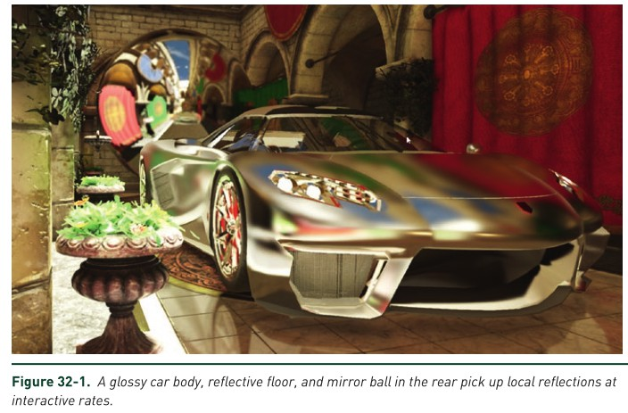

## 32.2 之前的工作
传统并广泛使用的反射技术包括平面反射、屏幕空间反射和各种基于图像的照明方法。
### 32.2.1 平面反射

平面反射很容易生成，但对于每一个具有平面反射面，都需要多次渲染场景几何体。根据所讨论的场景和引擎的不同，在CPU、GPU或者同时在两者上实现，都可能是一个代价高昂的操作。平面反射只适用于平面或近平面反射镜。粗糙表面的反射是有问题的，因为其只能捕获虚拟相机方向上的辐射照度。

### 32.2.2 屏幕空间反射

屏幕空间反射（SSR）是一种反射技术，它只使用屏幕空间数据来近似可见表面的高光反射项。主要的思想是根据表面的高光BRDF和来自主相机的照明缓冲器的光线的近似辐射度，在屏幕空间投射一条或多条光线。对于每条光线，使用光线步进（ray marching）从深度缓冲区数据计算命中位置。这使得SSR成为一种非常便宜的技术，因为它不需要复杂的输入数据，这使得它甚至可以在低端硬件上运行。动态场景当然也支持，无需任何额外成本。更多信息请参见McGuire和Mara[12]和Stachowiak[16]的工作。

不幸的是，SSR有很多缺点。首先，由于遮挡只作用于屏幕空间数据，因此基于深度缓冲区可能会错误地解释遮挡。在这种情况下，光线要么过早终止，要么穿过它实际应该击中的物体。第二，主相机辐射自然只有一层，因此在主相机视图中被遮挡的物体或在相机截锥外部的物体在反射中看不到。

### 32.2.3 基于图像的照明
基于图像的照明（IBL）技术从一些捕获的图像中获得近似的照明，这些图像通常存储为编码成球面的辐射图（也称为辐射立方体、反射立方体或反射探针）的辐射度探针中。每个探针都可以与一个代理几何体对象相关联，例如一个球体或一个立方体，它在场景中给出一个近似的击中点[11]。探针通常也经过预过滤，以便快速近似光泽材质，并且可以根据帧预算进行预计算或实时更新。读者可以参考Debevec的著作[3]了解有关IBL的更多信息。

### 32.2.4 混合方法

多种反射技术通常结合起来产生最终图像。例如，屏幕空间反射可以与离线生成的辐射探针一起使用，以创建近似的实时高光照明[5]。但是，混合各种技术可能会导致反射技术切换的地方最终照明出现明显的不连续性。

### 32.2.5 其他
最近有一些方法具有更高的质量，但它们带来了额外的计算成本。Voxel cone tracing 甚至可以在Crassin等人提出的动态场景中产生真实的高光反射项[1]，但它在体素尺度上运行。McGuire等人提出的方法[13]允许从一组预先计算的光探针计算精确的间接漫反射和镜面照明。这些探针增加了一个深度缓冲区，用于计算与屏幕空间反射类似的光线行进程序的交点。然而，这项技术并不是完全动态的。这两种技术都还没有在渲染引擎中得到广泛应用。

## 32.3 算法
基于之前的工作和对现代渲染引擎的综合观察，我们的算法设计源于以下的观察：

\> 当最终照明中没有不连续性时，即当相邻纹理像素成功地从屏幕空间采样时，屏幕空间反射有效地近似局部镜面反射项并产生逼真的结果。 然而，当通过其他方式（例如通过从辐射度立方体采样）计算辐射度时，会立即出现不连续性。 反射管道的其余部分必须与屏幕空间数据匹配，以消除这些不连续性。 重复使用屏幕空间数据还可以减少昂贵的辐射度的重复计算量。
\>只有光滑的类镜面的表面才需要高分辨率渲染。较低分辨率的近似值适用于较粗糙的表面的反射，因为结果在一组方向上取平均值。
\>在一组表面上追踪的光线可能会在场景中击中大致相同的点。 随着每像素的辐射度样本数量的增加，这变得更可能。
\> 对于游戏环境来说，拥有少量动态对象是很常见的。

在实践中，我们的算法通过光线追踪方法增强了先前的屏幕空间反射和辐射度探测技术。 我们独创性的贡献包括组合这些我们为探针采样定义的启发式方法的技术，以及对时域反射滤波的运动向量的修改。

图32-2显示了我们的算法集成到传统的延迟渲染管线中的各个阶段。绿色部分显示了简单的传统延迟渲染管线的步骤，而紫色部分是我们实现光线追踪反射的补充。新增的部分包括创建静态几何体的辐射度缓存、光照的辐射度缓存、辐射度采样生成和反射过滤。对静态几何体来说，我们的辐射度缓存的创建出来作为预处理的一部分。光照的辐射度缓存可以被视为对反射光线追踪和采样过程的解耦着色，并且缓存中找不到的光线只使用与普通光线追踪相同的材质和灯光信息进行着色。对从可见纹理元素追踪的所有光线计算出辐射度后，应用时空过滤器，过滤结果与漫反射和直接高光照明结合。只有在完全解决反射问题后，才会对最终照明应用体积照明等效果。这对于减少照明不连续性是必要的，因为采样的屏幕空间照明必须与辐射度缓存和完全着色的光线匹配。世界空间聚类过程起着重要作用；光线可以照射到场景中的任何点，因此可以使用世界空间数据结构来加速照明，而无需评估场景中的所有灯光。
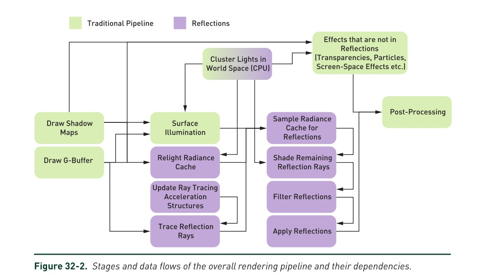

图32-3显示了使用我们的技术，屏幕空间照明纹理和辐射度探针如何从光线追踪管线计算的交点中采集辐射度。光线$R_2$的交叉点在屏幕上可见。辐射探针1能看到光线$R_1$、$R_2$和$R_3$的交点，辐射探针2能看到射线$R_1$的交点。对于所有这些光线，可以从缓存中采样辐射度。相反，在两个探针或屏幕空间数据中，光线$R_4$的交点不可用，因此必须显式地对其进行着色。虽然辐射探针本身必须进行着色处理，但多个光线可以使用相同的预计算值，这在着色复杂且有光泽的表面不需要对采样的辐射探针进行高分辨率处理时会带来很大的好处。此外，辐射探针的阴影具有局部性的好处；相邻像素可能会计算相同的光，并且从探针的G缓冲区中对材质进行一致采样。这些因素使高速缓存照明在现代GPU上高效计算。
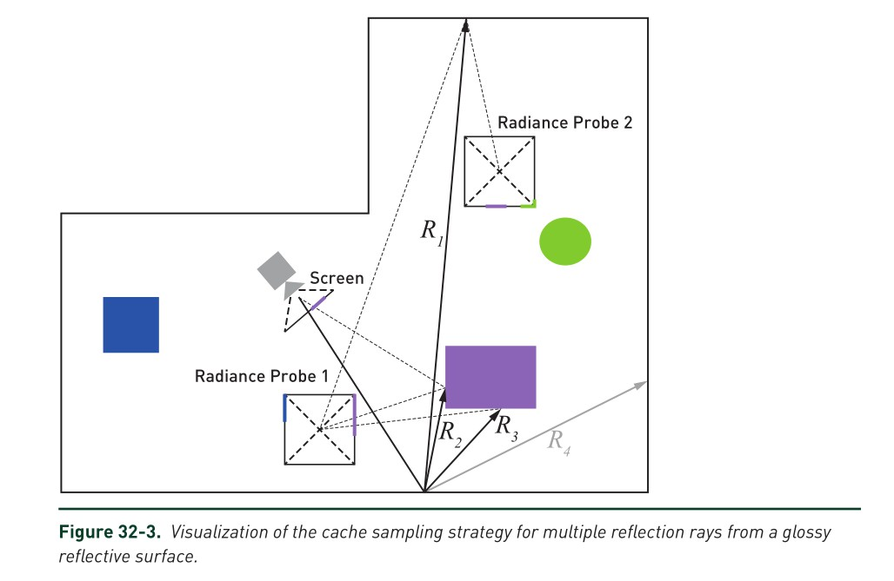
### 32.3.1 辐射度缓存

我们的缓存项，即辐射度探针，存储为立方体贴图(cube map)。由于立方体贴图是通用图形API中的天然支持的单位，因此易于呈现和采样。我们的目标是研究其他映射，例如McGuire等人[13]使用的八面体投影，作为未来的工作。与以前的方法相反，我们根本不预过滤探针。所有过滤都在屏幕空间中运行。

与早期技术类似，辐射度探针必须自动或手动放置在场景中，以覆盖大部分场景表面。在我们的例子中，探针是由艺术家手动放置到可见性最大化并且重叠最小化的位置。自动布局是未来工作的另一条途径。
#### 32.3.1.1 渲染
我们只将静态几何体渲染到我们的辐射度缓存中。这允许我们将几何图形的光栅化分离为预计算过程，从而从CPU和GPU中删除所有运行时几何图形处理负载。运行时GPU工作负载减少为延迟照明过程。我们系统中的每个辐射度探针都由一个完整的G-buff纹理集组成：反照率、法线、粗糙度、金属度和亮度。所有这些纹理都是照亮缓存样本所必需的。

#### 32.3.1.2 照明
照明过程评估缓存样本的所有直接灯光。我们对辐射度缓存照明使用与主相机照明相同的计算过程。当前系统中的每个完整探针都会重新照明每个帧。这可以通过只照明缓存中被光线击中的区域来进一步优化；有关更多信息，请参见第32.7节。我们的世界空间灯光聚类算法可以有效地为计算过程剔除光，而不考虑探针的位置。我们对主相机的照明也使用相同的灯光聚类方案。

关于高速缓存照明，需要注意的一点是，照明期间的视图固定在主相机的视图上。尽管这是错误的，但这使得照明与主相机照明相匹配，从而消除了将屏幕空间命中与缓存命中或完全着色光线组合时可能出现的任何接缝。视图主要影响直接照明的高光反射项。
### 32.3.2 光线追踪
我们算法中的主要光线跟踪过程负责根据我们的高光BRDF生成样本方向，跟踪光线，并存储后一个过程的命中信息，这些信息是对光线集合的实际计算辐射度。
#### 32.3.2.1 采样高光 BRDF
在X点处，高光反射引起的入射光，几何法向量为$ω_g$，视线方向为$ω_o$，由渲染方程得出：
$$ 
L_0({X,\omega_0})=\int_{\Omega_i}L_i(X,\omega_i)f_s(\omega_i,\omega_o)(\omega_i·\omega_g)d\omega_i \tag{1}
$$

其中，$Ω_i$是X点上的正半球，$ω_i$是该半球的方向，对于BRDF $f_s$，我们使用cook-torrance模型，其ggx为微表面法线分布。这可以用蒙特卡罗积分和重要性抽样计算
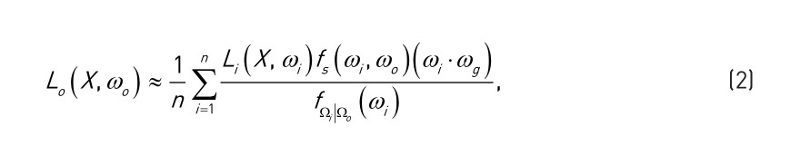
这里的$f_{\Omega_i|\Omega_v}$是采样的概率密度函数。为了去采样$f_s$.我们使用可见法线ggx分布通过利用Heitz[7]引入的精确采样程序和基于2和基于3的预先计算的Halton序列[6]作为采样程序的输入。然而，我们不直接使用等式2中的近似值，而是采用Stachowiak[16，17]提出的相同方差的折中方案，将其除并乘以相同的因子$f_s(\omega_i,\omega_o)(\omega_i·\omega_g)d\omega_i$并且分母离散化：
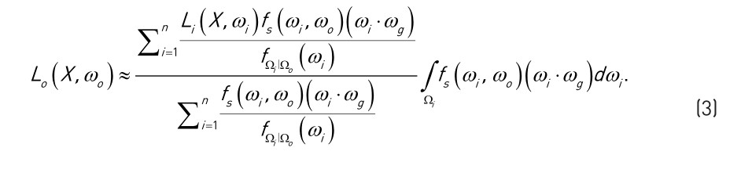
项$f_s(\omega_i,\omega_o)(\omega_i·\omega_g)d\omega_i$是$(\omega_i·\omega_g)$、粗糙度以及入射角处的反射率（基反射率）的函数。当使用Schlick近似值[15]而不是完整的菲涅耳项时，基本反射率可以从积分中分解出来，半球上的BRDF积分可以用有理函数来近似。我们用数学中的数值误差最小化方法推导了这样一个近似，并得出
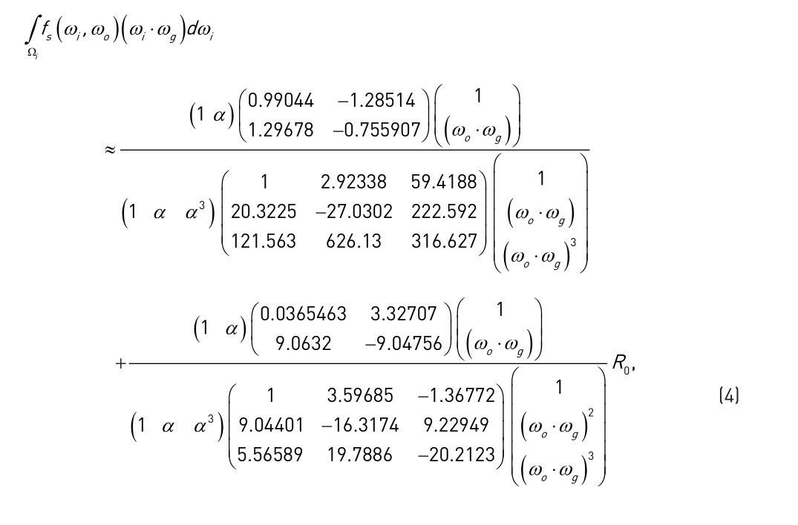

公式中，α是ggx模型中线性粗糙度的平方，$r_0$是平行于法线的反射。由于预积分项是无噪点的，根本不需要过滤，因此该技术具有保存与某些表面特性相关细节的进一步优势。方程4提供了一种快速计算这个积分的方法。另一种方法是将函数制成表格并在该表中执行查找[10]。
####32.3.2.2 生成光线和命中存储
在我们的算法中，实际的光线跟踪部分很简单，因为辐射度的计算与光线追踪是分离的。光线追踪管线仅用于查找正确的场景交点。清单32-1给出了光线生成和命中着色器的伪代码。

利用重要采样方向生成光线，以G-buffer深度重建的表面位置为原点。粗糙度值超过`RT_ROUGHNESS_
THRESHOLD`的材质不会产生光线；对于此类材，仅使用方向向量从缓存中采样辐射度。对于追踪光线，光线长度、重心坐标、实例索引和最终命中的原始索引将写入纹理，但此过程中不需要进一步的工作。存储几何数据是因为项$l_i(x，ω_i)$并非总是能在屏幕空间辐射度或辐射度缓存中找到，必须使用正确的材质计算。注意，我们的实现支持每个实例一个材质，因此实例索引唯一地标识使用的材质。每个实例具有多个材质的实现需要写出更多的数据。

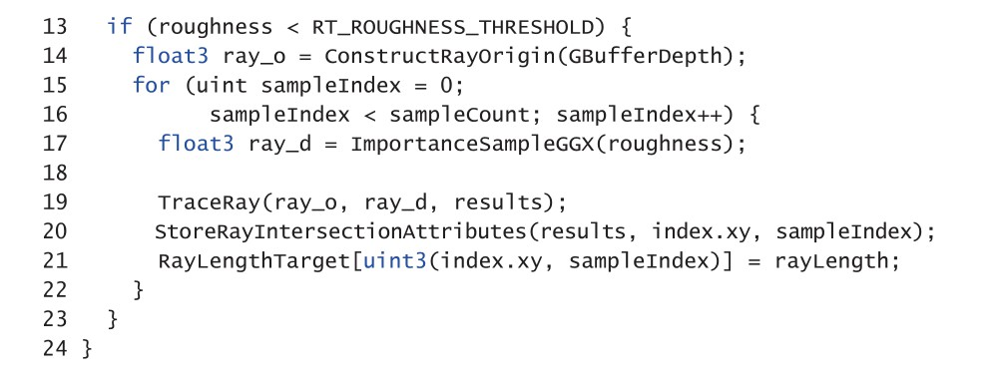
### 32.3.3 光线辐射度计算
如第32.3.2.1节所述，我们使用方差减少方案，其中随机抽样结果除以每个辐射度样本的权重之和，然后将结果乘以半球上BRDF积分的近似值。将简化的符号应用于方程3，使$L_{toal}$是加权辐射度样本的和，$w_{total}$是单个像素的样本权重的和，高光反射的总辐射量可以写为
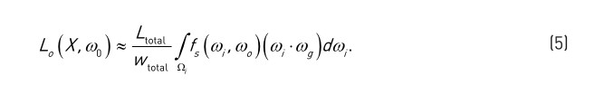
与Stachowiak的工作[16]相似，，由于直接去噪一个比值估计量并不能使近似收敛到正确的结果[9]。因此所有的项只有经过时空滤波后才能组合。每个像素的总和$L_{total} $和$w_{total}$被辐射度缓存采样过程和光线着色过程写入以分离纹理：首先，缓存采样过程写入缓存中存在的所有光线的项，然后光线着色过程累积$L_{total}和$w_{total}$缓存中没有辐射度采样的光线。缓存采样和光线着色过程的实现将在后面的章节中讨论。

#### 32.3.3.1采样辐射度缓存和屏幕空间照明
由于计算到缓存和屏幕空间照明中的辐射度匹配，因此它们都可以用于近似辐射度$l_i（x，ω_i）$。重要采样方向$ωi$可以重新生成以获得与光线跟踪过程中相同的方向，交点可以从光线跟踪过程中写入的方向向量、G-buffer和光线长度计算。为了对主相机照明纹理进行采样，将交点投影到屏幕空间，并使用获得的texel坐标继续采样。通过将屏幕空间G-buffer深度与计算出的深度进行比较，验证了辐射度样本的有效性。如果采样失败，则可以使用立方体贴图中指向此光线交的世界空间方向向量对任何辐射度探针进行采样，但需要本节后面介绍的某些阈值来确保采样的正确性。

清单32-2显示了采样过程的概要。请注意，对于粗糙度高于某个阈值（rt_粗糙度阈值）的材料，我们使用代理几何交点生成命中位置，并使用该方向对辐射探针进行采样。
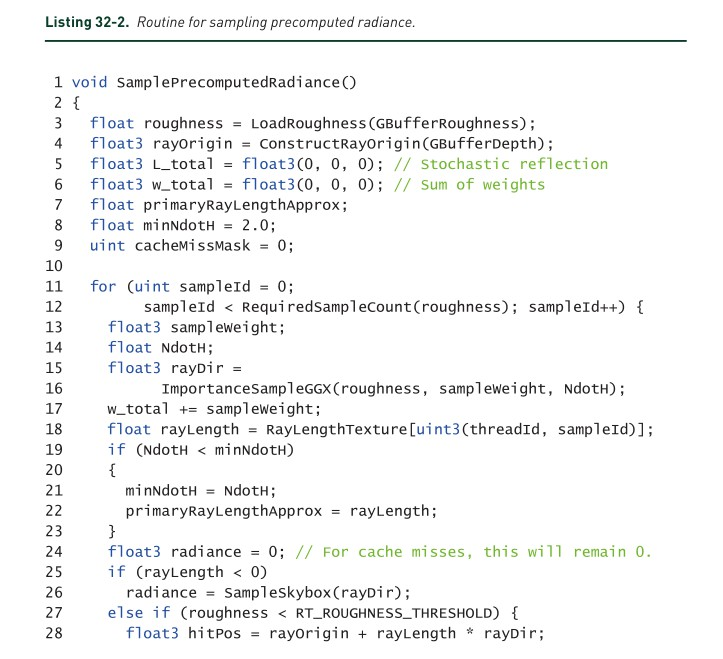
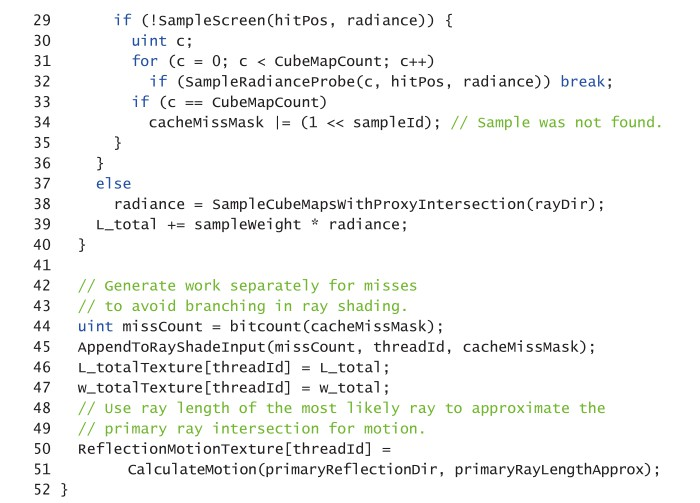

清单32-3给出了单探针采样的伪代码。
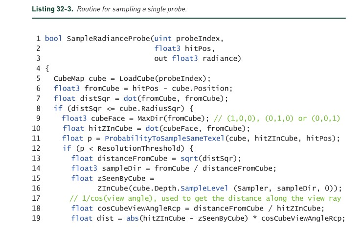
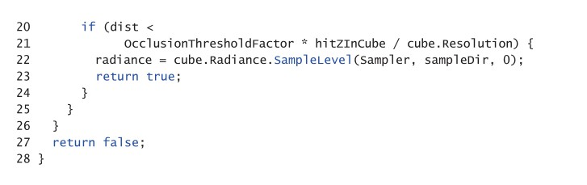

进行半径检查是为了加快计算速度，并且应调整半径使该半径以外的样本不会存在或不具有足够多的细节。为了进一步的优化，可以使用聚类来避免半径检查，就像用于点光源一样。遮挡检查是为了确保采样位置与实际命中位置相对应，因为辐射探针前面可能存在遮挡几何体，或者交点可能位于辐射探针中不存在的动态对象中。由于我们对分辨率进行了单独的检查，因此我们定义了距离阈值，以允许可能由低分辨率引起的深度变化。我们使用函数$\beta\frac{z_c}{x_c}$，其中$z_c$是立方体中交点的深度，$x_c$是立方体分辨率，β是一个常数，应该调整到足够大，以允许从与反射立方体的视图中光线不垂直的表面取样。图32-4显示了由于被其他几何体遮挡而无法从立方体图中找到的反射光线交点的示例。
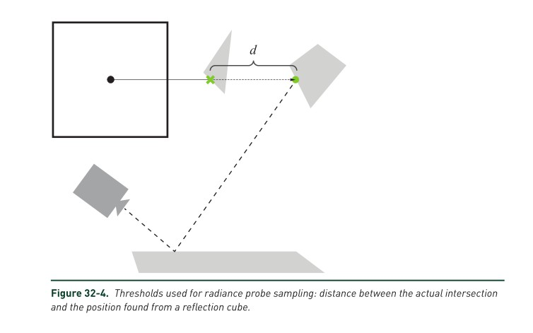

在确定辐射度探针分辨率的阈值时，我们使用了一种启发式的方法，考虑了辐射度探针的有限分辨率对反射方向的影响，并考虑了该方向的重要性采样的分布。为了量化这个错误，我们分析了在辐射探针中混叠到相同纹理像素的采样点的概率(清单32-3中的函数``ProbabilityToSampleSameTexel``)。图32-5显示了在辐射度探针中，来自同一表面的三束光线中的两束混叠到一个样品中
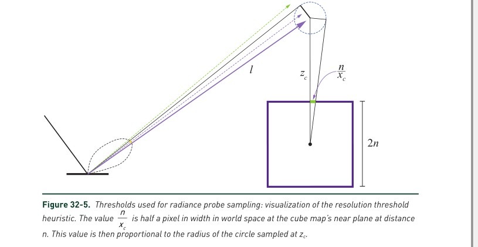

概率可以通过积分微面分布函数得到

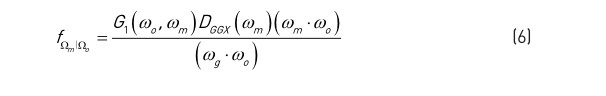
在半球上的一个区域上，该区域以精确的微表面法线为中心，并由一个区域限定，该区域的大小是根据辐射探针中像素之间的间距得出的。采样点（图32-5中圆的中心）可以由一个覆盖辐射探针中单个纹理像素的球体绑定。假设球体的中心位于立方体的轴上，则其半径由
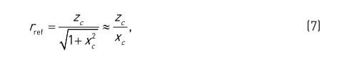

其中，$z_c$是采样点的线性深度，$x_c$是辐射度探针立方体贴图的分辨率。对于立方体，到近平面的距离n会抵消，因此不会影响计算。可以推广离轴采样点的计算，但我们将忽略它，因为在立方体贴图中，误差仅限于近似值的有限常数。

现在我们需要评估反射光线击中那个球体的概率。虽然存在在球面[8]等区域上积分brdf的精确近似，但在我们的例子中，我们只需要一个有效计算的粗略近似。反射固体角上的反射方向密度由下式得出：
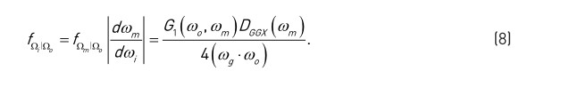
假设投影球体的立体角很小，我们可以近似地在立方体图中采样纹理像素的概率：
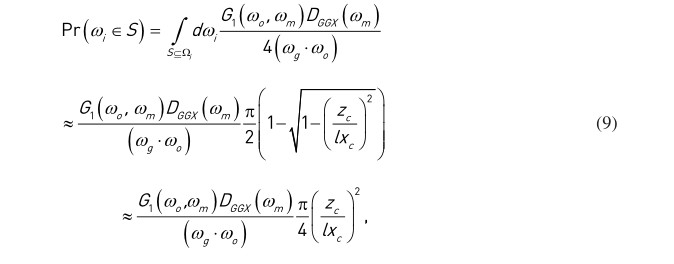

式中，l是图32-5中反射光线的长度。第一个近似值是通过进行单个样本蒙特卡罗积分（域中的某个值乘以积分体积，即球面所对的立体角）得到的，第二个近似值是通过平方根项的泰勒展开得到的。然后可以将阈值定义为0到1之间的任意值。例如，阈值为0.1意味着如果对纹理像素进行采样的概率为10%或更高，则立方体将被拒绝，因为单个纹理像素不包含重建反射所需的高频信息。然而，如果概率足够低，则纹理像素足以重建反射信息。后者通常适用于高度粗糙的表面，或者当采样方向位于$D_{ggx}$分布的尾端时。请注意，对于完美和接近完美的镜子，几乎永远都不满足此阈值，但由于视图的分辨率有限，样本可能仍然是可接受的。因此，在计算阈值时，我们将表面粗糙度α钳制到一个可调的最小值，以允许从分辨率相对较高的立方体中取样。在未来的工作中，表面曲率和视图分辨率本身也可以直接考虑。
#### 32.3.3.2 着色未命中缓存光线

使用辐射度探针覆盖整个场景，以便在某些探针中每个点都是可见的，这在实际场景中需要非常多的探针，而且每个探针都增加了采样和重新采样的开销。此外，我们不包括动态几何探针，探针的分辨率可能太低的一些射线，特别是高度光滑的表面。因此，我们仍然需要一种健壮的方法来重建那些在任何探针或屏幕空间光照纹理中都不可见的光线交点的辐射度。

作为回退，我们对每个未着色样本使用单独的计算过程计算辐射度。当光线追踪过程写入几何实例索引、图元索引和重心坐标时，这些参数可直接用于构建精确的点并查询照明过程所需的所有数据。虽然现在可以为高光使用精确的光线方向，但是这里我们使用相机的方向来匹配为辐射度缓存和屏幕空间照明计算的高光照明。

为了避免在warp/wavefront内根据需要着色的样本数进行分支，我们将缓存未命中的光线索引压缩到采样过程中的单独缓冲区中。然后，另一个计算过程将对从缓冲区读取的每一条所需光线应用辐射度计算，以便在一个warp/wavefront内的每一条线都有相同的工作量要执行。这一点很重要，因为对于光泽反射，像素之间的方向具有高方差，因此缓存未命中在大面积内随机分布，一些warp/wavefront将执行辐射度计算，仅因为一个或几个通道有缓存未命中。
## 32.4 时空滤波
所描述的算法提供了高光环境照明项的粗略近似。但是，由于在极端情况下，每像素一个样本的样本计数较低，因此得出的近似值会有噪点。因此，所得到的辐射度估计值必须在空间和时间上进行积极的过滤，以消除因对渲染积分进行低采样而产生的高频噪点。观察到的噪点量取决于表面属性和场景中灯光的分布。

在本节中，我们描述了一个过滤方案，用于生成第32.5节中所示的结果。由于过滤不是本章的主要主题，因此只提供了一个带有参考的简短描述。实际上，反射过程中的噪点与路径跟踪中的噪声相似，任何适合于清除路径跟踪图像的算法都可以在这里工作。注意，类似于Heitz等人[9]过滤过程，我们使用的比值估计器的两项都是单独应用滤波过程的，且仅在滤波后才对两项进行组合如第32.3.3.1节所述。
### 32.4.1 空间滤波

通过空间滤波，我们的目标是通过在像素邻域上共享样本来补偿低数量的样本。仅当相邻像素在表面属性中匹配时，才共享采样。我们的空间滤波器是基于 edge-avoiding Á-Trous wavelet transform[2]的，我们使用特定的反射相关权重函数进行增强。我们对Á-Trous wavelet transform进行多次迭代，每次迭代都会生成一组比例系数。这些系数提供了内核足迹的低通（ low-pass）表示，并且没有不需要的高频噪声。这个转换使用前面的系数作为下面迭代步骤的输入。这允许我们在大屏幕空间区域有效地积累过滤后的样本，而权重函数则抑制无效的样本。见图32-6。
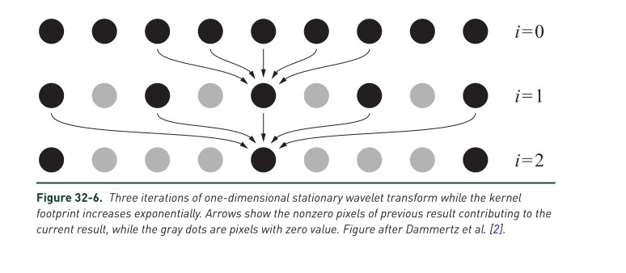

我们的实现遵循了Dammertz等人[2]和Schied等人[14]之前的工作。每一次小波迭代都作为一个5×5交叉双边滤波器进行。贡献样本由函数$w（p，q）$加权，其中p是当前像素，q是来自样本邻域的贡献样本像素。我们计算标度系数$s_{i+1}$为
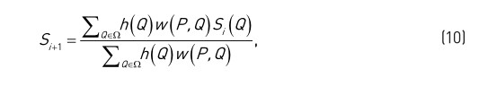
在这里$h(Q)=(\frac{1}{8},\frac{1}{4},\frac{1}{2},\frac{1}{4},\frac{1}{8})$是过滤核。权重函数$w（p，q）$基于样本的G-buffer属性控制样本q的贡献。有助于此权重函数的组件可分为四组：边缘停止、粗糙度、反射方向和光线长度。以下部分将讨论这四个组。

为了简化权重函数，我们将函数$f_w$定义为限制a和b之间的平滑插值函数，如下所示：
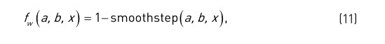
其中，**smoothstep**是由着色语言提供的标准cubic Hermite interpolator。

#### 32.4.1.1 边缘停止权重

边缘停止权重阻止了样本在几何边界上的分布，并考虑了P和Q处的深度和正常值之间的差异。这些功能基于Schied et_al之前的工作。[14]深度重量$w_z$为
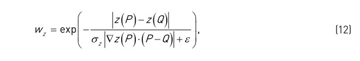
式中，$z(p)$为深度梯度，$σ_z=1$为实验确定的常量值，$ε=0.0001$为防止被零除的常量值。此外，权重$w_n$基于p和q处的法线之间的差异，定义为
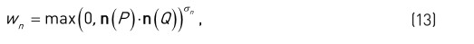
式中，$σ_n=32$再次是基于实验的常数。
#### 32.4.1.2 粗糙度权重

粗糙度权重模拟粗糙度对反射lobe的影响。首先，与当前像素相比，我们只允许具有相似粗糙度值的样本，从而获得相似形状的反射lobe：
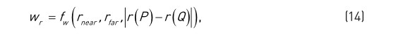
其中$r_{near}=0.01$和$r_{far}=0.1$是根据实验选择的常数。第二，我们根据粗糙度和权重控制生成样本的过滤半径。
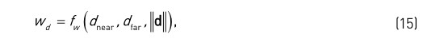
其中，$d_{near}=10r(P)$，$d_{far}=70r(P)$，d=P−Q是从当前像素位置到样品像素位置的矢量。
#### 32.4.1.3 反射方向权重

反射方向权重通过将过滤核缩放到反射方向，使其具有各向异性：
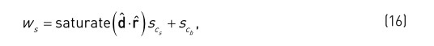
其中r是屏幕空间中的反射方向，$S_{c_{s}}=0.5$比例因子，以及
$S_{c_{b}}=0.5$是缩放偏差。
#### 32.4.1.4 光线长度权重

光线长度权重的设计是为了控制聚集半径与光线长度的函数关系：击中点越近，我们越不希望相邻样本提供贡献。因此，重量$w_l$变为
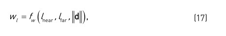
在这里$l_{near}=0并且l_{far}=10.0 r(P)$
最后，我们可以将所有权重组合成一个函数：
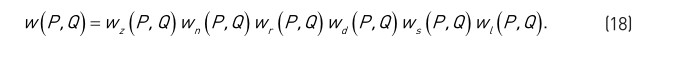

### 32.4.2 时间滤波
不幸的是，空间滤波往往不足以达到所需的质量。因此，除了在像素邻域中积累样本外，我们还可以在多帧上临时积累样本。这是通过使用指数移动平均值在当前帧样本和以前的时间结果之间进行插值来实现的：
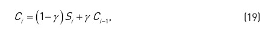
其中，$c_i$是当前帧输出，$c_{i−1}$是使用速度矢量投影的前一帧输出，$s_i$是当前帧输入（即反射缓冲器）。第32.4.3节进一步详细讨论了获取反射速度矢量的问题。权重γ表示历史数据与当前帧之间的插值比率，基于多重启发式。

光泽反射在时间样本之间可能有显著的颜色差异。这可以防止我们依赖基于颜色值的方法（如方差剪裁）来消除重影。相反，我们使用第32.4.1节中基于几何的权重函数的子集来定义γ。这是通过首先投影P来生成使用速度矢量的贡献样本的采样位置，然后使用速度矢量对上一帧的表面属性进行采样来完成的。因此，我们还必须保存前一帧的G缓冲区中的深度和正常属性。

此外，我们还包括基于当前样品粗糙度的重量$w_{r_{max}}$。这样做是为了使非常光滑的表面，如镜子，忽略不必要的时间采样以删除任何可能的重影。重量计算如下：
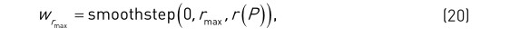
其中，$r_max=0.1$是一个恒定阈值。因此，

是用于对当前帧和前一帧进行加权的总权重。
但是，重影仍然可以出现在具有恒定粗糙度的平面上，其大小足以不被夹紧，但平滑程度足以使重影清晰可见。这些伪影是最明显的亮光源反射或快速移动明亮的彩色物体。不幸的是，几何权重函数无法解决这一问题，因为我们无法通过比较反射面来解释反射中可见对象之间的差异。因此，我们选择为当前反射结果实现一个5-160；：160；5滤波核，以计算入射光L和滤波后的BRDF的方差，同时使用边缘停止函数来防止在几何边界上采样。然后将它们用于时间过滤结果c i的颜色-空间方差剪辑，因此它们可以防止时间结果与与当前帧的完全不同的颜色值混合。这类似于通常使用时间消除混叠进行的方差剪裁，只使用不均匀的采样权重来防止在几何边界上采样。
### 32.4.3 REFLECTION MOTION VECTORS
通过反射看到的物体需要调整运动矢量，因为速度不仅仅是物体速度在屏幕上的投影。
#### 32.4.3.1 UNDERSTANDING THE PROBLEM
为了解决这个问题，我们将从一个完全静态的系统开始：一个照相机、一个反射镜和一个在反射中看到的物体。在图32-7中，光从p-o处的物体向多个方向发出；其中一个光子在p-s，0处从反射器完美反射并到达眼睛。这个物体被探测到，就好像它是沿着光线的某个地方击中眼睛一样。
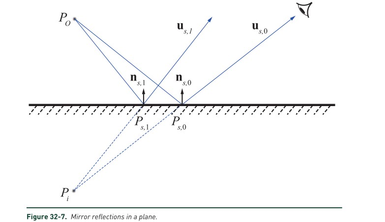
请注意，如果眼睛移动到另一个位置，来自对象的光也到达该位置，那么该对象将出现在同一个位置。把眼睛移到新的点上，我们得到多条光线，它们在表面下的某个地方相交。这个交点是π，它被称为物体的图像。在这种特殊情况下，光线在过去相交，因此图像是虚拟的，而对于其他配置，光线可以在未来相交，我们得到一个真实的图像。此外，在实际配置中，光线常常不能完全相交，而是得到一个混淆的圆。然而，为了解决这个问题，我们将忽略这个场景，并假设光线总是收敛的。
总体战略现在应该变得清晰了。我们要取代对物体的显式处理，试图通过处理物体的图像并按原样使用其速度来收集物体的速度。处理图像而不是对象也更自然，因为我们在屏幕上看到的是图像，所以我们应该分析它而不是对象本身。
#### 32.4.3.2 DIRECT SOLUTION
用最小二乘法求p i的一个简单方法是求直线交点的解，如

这里，p s，j是局部足迹表面上的点，u s，j是这些点的反射方向，如图32-7所示。
速度的解可以通过对时间的微分得到。但是，这很麻烦，需要大量的信息。
#### 32.4.3.3 GEOMETRICAL OPTICS APPROACH

如果我们反射点假设局部球面，我们可以显著地简化问题。点是局部球形的，利用是高斯公式可以求解从球面反射的物体的图像问题，该方程由下式给出：
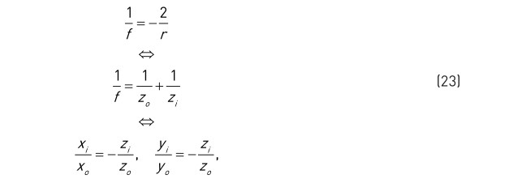
其中r是曲率半径
#### 32.4.3.4 OBTAINING OPTICAL PARAMETERS

本节的开头部分假设读者熟悉曲面微分几何的主题。关于微分几何的深入讨论，我们请读者参考卡莫的书[4]。
在图32-8中，$p_s$描绘了反射镜在世界空间坐标中的点，该点投射到像素上（在屏幕上看到），$p_{s，j}$是相邻像素的表面点。反射相互作用发生在法向平面，即在反射点与切向平面正交并包含视图矢量的平面。在这个平面上，圆形反射镜的半径是投影到反射点$P_s$的切平面上的视图方向上的法线曲率$k_n$的倒数。但是，$κ_n$依赖于视图，当相机移动时会发生变化。因此，我们不使用视图方向的法向曲率，而是使用主曲率$k_s$，它可以生成最接近观察者的图像。这个值可以通过计算主曲率和选择在查看器前面生成最近图像的曲率（负曲率可以在查看器后面生成图像）来找到。这一决定有效地迫使反射点是脐带形的（因为总是使用相同的法向曲率，而不管视图如何）。因为r是$k_s$的倒数，所以它可以是无穷大的（对于平面），但不能是零。这同样适用于焦点。因此，我们将使用半径和焦点的倒数。
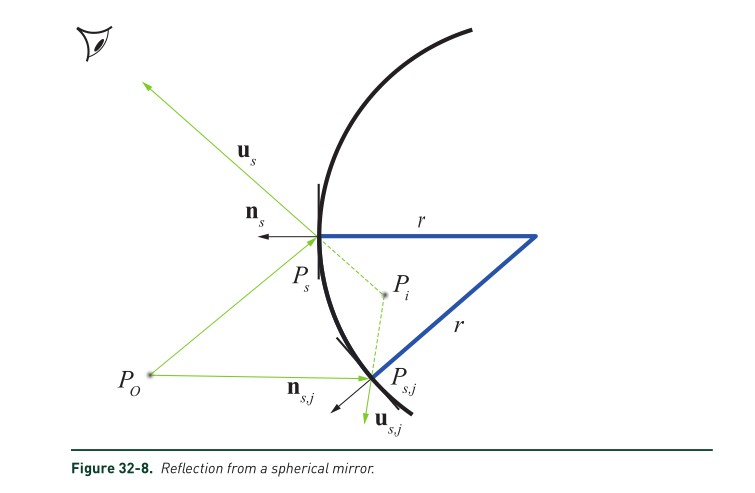
对于正交基x，y，n s，反射对象坐标为
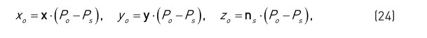
其中$P_o和P_s$分别是被反射物体和反射器的世界空间位置。从薄透镜方程中获得的图像坐标$（x_i y_i z_i）^T$将世界空间中的图像位置指定为
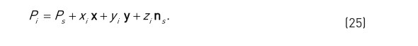

请注意，当将其用作光泽反射的时间过滤过程的输入时，我们希望暂时扩展采样计数，即从历史中找到可能从类似分布中采样的样本，而不是可能与相同位置相交的样本。因此，我们使用像素的最高概率射线的长度乘以主反射方向来估计最可能射线的交叉点。
用我们的方法计算的运动矢量比主要的撞击表面运动矢量，或比不考虑反射表面曲率的方法，能更好地估计曲面中的重投射撞击位置。如图32-9所示。
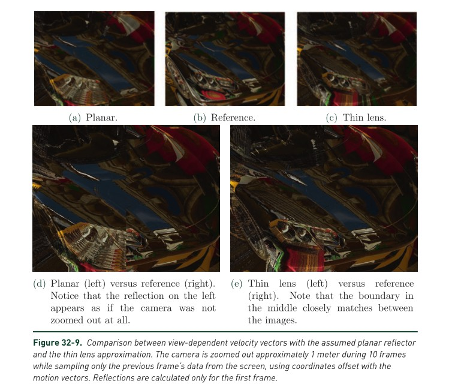

#### 32.4.3.5 VELOCITY TRANSFORMATION FOR DYNAMIC OBJECTS

如果基向量x和y是在不依赖于视图的情况下选择的，那么它们对相机位置没有时间依赖性。它们对表面法向量有时间依赖性，当反射镜旋转时，曲面法向会发生变化。然而，我们将忽略这一变化，并假设$x=0,y=0,n=0$。式24和式25的时间导数为
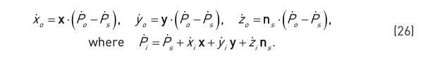
从式23中，我们得出
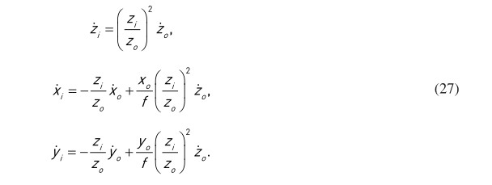
根据公式26和27可以很容易地计算出图像点的速度，然后投影到屏幕上，以获得屏幕空间运动矢量，如下所示。给定将世界坐标转换为屏幕坐标的矩阵m和反射镜的屏幕坐标$（x_{ss}，y_{ss}）$，
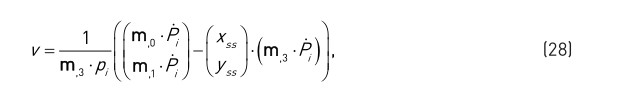
其中$m_{,i}$表示**M**的第i行，这仅表示图像的速度；需要单独添加由摄像机移动引起的附加速度分量。然而，由于速度是相对的，摄像机的速度可以从方程26中物体和反射镜的速度中减去。这使得矩阵**M**与计算时间无关。另一种计算屏幕空间运动矢量的方法是通过欧拉迭代将图像位置及时向后推进，将其投影到屏幕上，并获取屏幕空间的差异。

## 32.5 结果

我们在标准的Sponza scene中测量了我们的算法在五个不同场景中的结果。我们将其与完全着色的参考进行比较，即，无缓存的高光计算。现场安装了11个缓存采样点。我们使用0.8的粗糙度阈值（RT_MAX_ROUGHNESS）。所有数字都在Nvidia RTX 2080 GPU上捕获，分辨率为2560_×1440。

除了图32-10所示的最终照明和反射项图像外，我们还包括反射遮罩的图像。遮罩是每像素反射路径类型的彩色编码可视化。遮罩中的紫色表示最便宜的路径：仅使用方向向量进行采样。绿色和橙色区域是光线跟踪的：从屏幕空间中对深绿色像素、从缓存中对浅绿色像素进行采样，并对橙色像素进行完全计算，这表示最昂贵的计算路径。

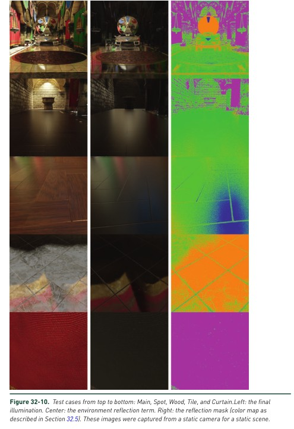
### 32.5.1 性能

我们用1和1到4的采样数来测试性能，并用表面粗糙度来测量。结果分别见表32-1和32-2。对每一个过程分别给出性能。光线仅在光线跟踪过程中进行跟踪，该过程会为可能的光线着色过程写出所有必要的数据。对于所有测试用例，缓存重新启动时间（自然）是恒定的。其他部分的性能主要取决于采样数量和辐射缓存的利用率。如果缓存根本无法使用，我们的技术将恢复为光线的完全着色。在这种情况下，缓存照明和采样（所有被拒绝的样本）产生的开销将全额支付，除了全光线着色的成本。tile场景包括这样一种情况，在这种情况下，我们的算法执行类似于完全着色。
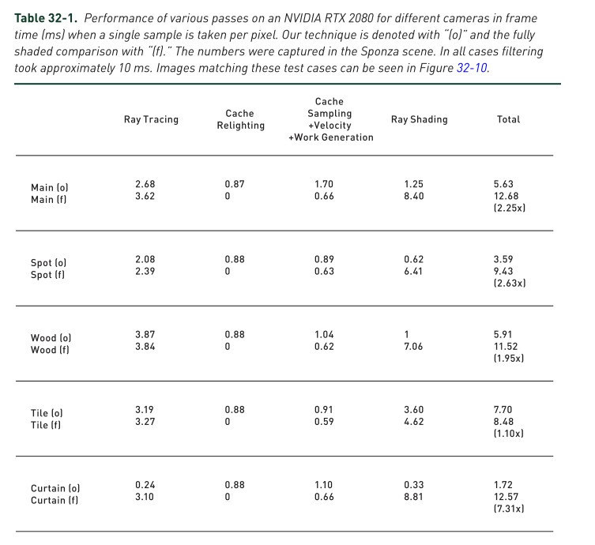
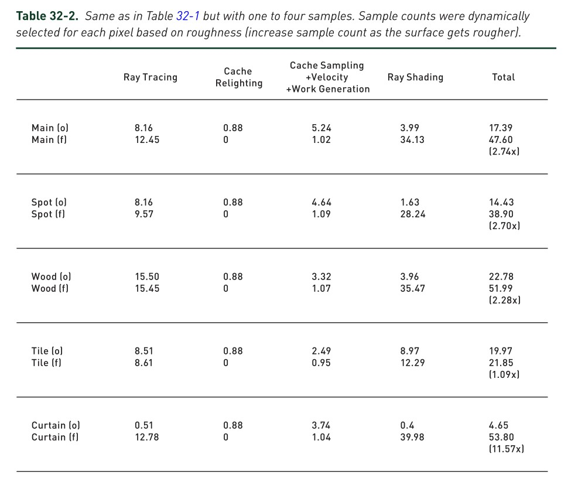

当光线跟踪部分可以完全跳过时，我们的算法具有最高的性能。这可以在使用粗糙材质的窗帘场景中看到。在这种情况下，一个样本的性能差接近7倍，而多个样本的性能差接近15倍。

场景从屏幕空间或辐射缓存中提取斑点和木材样本。这些场景需要光线跟踪，但在着色期间仍然采用快速路径。在这些情况下，我们的算法比完全着色快大约2倍。在这些情况下，反射是有光泽的，这有助于缓存的使用。
在主场景中可以看到一个平衡的例子。这张照片包含了所有类型的表面，从粗糙的岩石到抛光的瓷砖地板。我们再次测量了与全阴影相比2.5倍的性能改进。
### 32.5.2 质量
图32-11显示了一个光滑的表面，与使用我们的技术计算的反射相比，每一个光线阴影参考。即使从低分辨率缓存中提取了一些样本，我们的技术的质量也是相当的。一般来说，由于我们的采样启发式算法，反射的质量在很大程度上不取决于缓存的大小。较小的缓存将导致更多的未命中，但总体质量仍接近引用。如图32-12所示，将256_256的缓存分辨率与32_32的缓存分辨率进行比较。
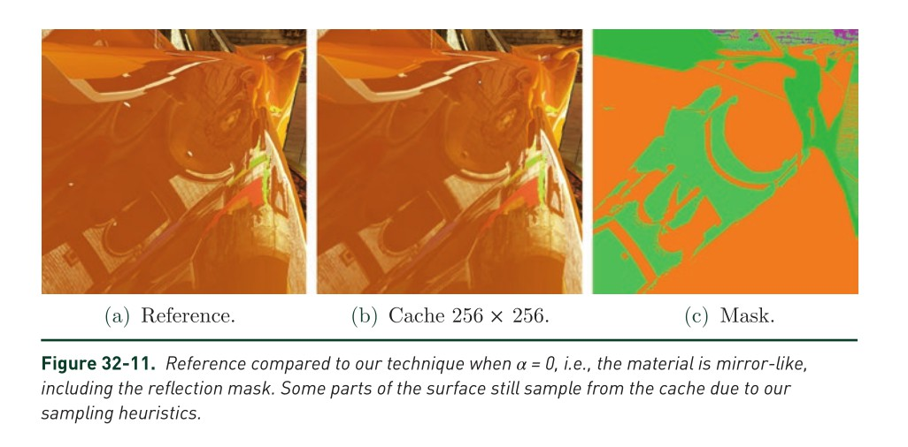
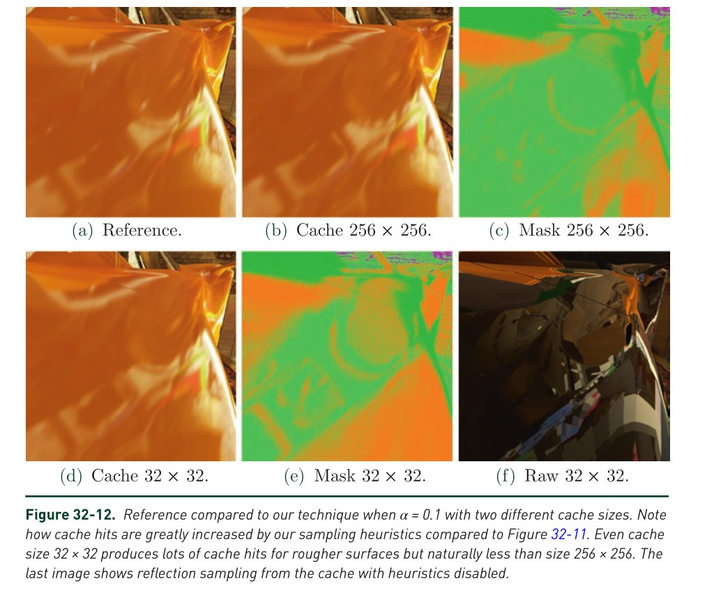
随着表面粗糙度的增加，噪点也自然增加，特别是当使用每个像素的单个样本时。然而，时空滤波可以大大降低这种噪声，并且可以采取多个样本来平衡滤波的成本。对于较粗糙的表面，有限分辨率的辐射度缓存更有效，如图32-13所示，这使得我们的技术更能负担得起多样本的方法。使用我们的技术，拥有多个样本也会更便宜，因为辐射度缓存的重用会增加，只有缓存未命中才会被冗余地着色。

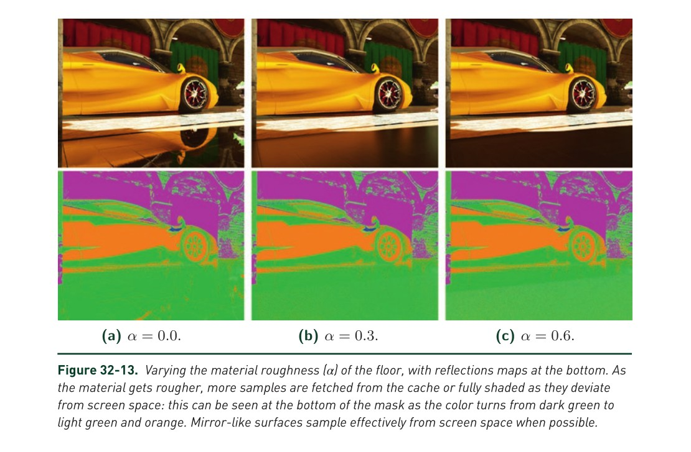
时空滤波的降噪如图32-14所示。虽然方差裁剪无法消除反射中移动轮廓造成的所有重影，因此会留下一些小瑕疵，但在相机移动时很难注意到这些瑕疵。另外，右侧窗帘的粗糙度高于``RT_ROUGHNESS_THRESHOLD``，而另一侧的亮度采样不准确，但这一问题，尽管在最终结果中很难注意到，但可以通过更仔细地放置探针来缓解。除上述伪影外，整体结果与参考图像很接近，参考图像由多个样本计算直至收敛。
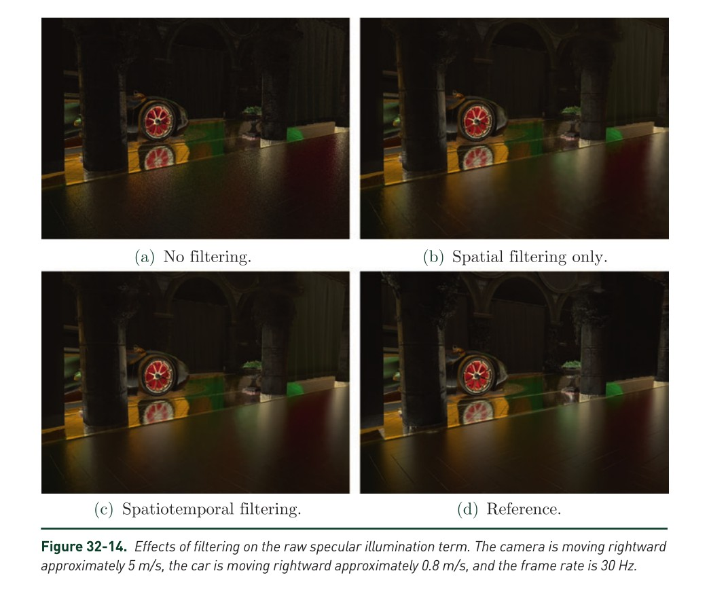

## 32.6 总结
在本章中，我们介绍了一种为动态场景生成真实的实时高光照明的技术。我们的方法结合了新旧技术：我们使用新的DXR的API查询场景可见性，但在屏幕空间或缓存空间中进行大部分着色。在这两种情况下，由于相邻线程之间的一致性，现代GPU的效率得到了充分利用。只有一些光线通过更昂贵的、发散的全阴影路径。特别是对于粗糙度超过阈值的粗糙表面，可以预计会有巨大的性能改进：对于这些表面，可以完全跳过光线投射，从而消除许多光线。然而，即使没有光线跟踪，这些表面也会从我们不断更新的稀疏照明缓存中获得实时的高光反射项。
## 32.7未来工作
算法的各个部分都有改进的途径： 
\>间接漫反射：类似的方法可以用来计算间接漫反射照明。未命中缓存的光线可以从低频源获取信息，例如填充孔算法。
\>改进的缓存照明：我们的缓存现在照亮了每一帧。然而，可以建立一个改进的系统，只照亮那些实际使用的立方体面甚至样本。例如，每帧只能照亮最重要的多维数据集。
\>辐射度缓存几何：这里描述的实现使用立方体贴图（即球形捕获）进行缓存存储。但是，这会浪费空间，因为不同的缓存点可以看到相同的曲面。因此，我们计划研究其他缓存数据结构，以提高缓存利用率。
\>孔洞填充：对于某些表面，反射遮罩可能非常嘈杂，这意味着一些相邻的像素要么从立方体采样要么对整个光线进行着色。由于整个光线的着色成本更高，因此可以根据相邻像素数据填充一些小孔，尤其是对于粗糙的表面。
\>过滤：本章介绍的过滤对于实时使用来说有些昂贵。未来，我们的目标是寻找更轻的过滤解决方案，在质量和性能之间做出不同的权衡。

## REFERENCES
[1] Crassin, C., Neyret, F., Sainz, M., Green, S., and Eisemann, E. Interactive Indirect Illumination Using Voxel Cone Tracing. Computer Graphics Forum 30, 7 (2011), 1921–1930.
[2] Dammertz, H., Sewtz, D., Hanika, J., and Lensch, H. Edge-Avoiding À-Trous Wavelet Transform for Fast Global Illumination Filtering. In Proceedings of High- Performance Graphics (2010), pp. 67–75.
[3] Debevec, P. Image-Based Lighting. HDRI and Image-Based Lighting, SIGGRAPH Courses, August 2003.
[4] do Carmo, M. P. Differential Geometry of Curves and Surfaces. Prentice Hall Inc., 1976.
[5] Elcott, S., Chang, K., Miyamoto, M., and Metaaphanon, N. Rendering Techniques of Final Fantasy XV. In SIGGRAPH Talks (2016), pp. 48:1–48:2.
[6] Halton, J. H. Algorithm 247: Radical-Inverse Quasi-Random Point Sequence. Communications of the ACM 7, 12 (1964), 701–702.

[7] Heitz, E. A Simpler and Exact Sampling Routine for the GGX Distribution of Visible Normals. Research report, Unity Technologies, Apr. 2017.
[8] Heitz, E., Dupuy, J., Hill, S., and Neubelt, D. Real-Time Polygonal-Light Shading with Linearly Transformed Cosines. ACM Transactions on Graphics 35, 4 (July 2016), 41:1–41:8.
[9] Heitz, E., Hill, S., and McGuire, M. Combining Analytic Direct Illumination and Stochastic Shadows. In Symposium on Interactive 3D Graphics and Games (2018), pp. 2:1–2:11.
[10] Karis, B. Real Shading in Unreal Engine 4. Physically Based Shading in Theory and Practice, SIGGRAPH Courses, August 2013.
[11] Lagarde, S., and Zanuttini, A. Local Image-Based Lighting with Parallax-Corrected Cubemaps. In SIGGRAPH Talks (2012), p. 36:1.
[12] McGuire, M., and Mara, M. Efficient GPU Screen-Space Ray Tracing. Journal of Computer Graphics Techniques 3, 4 (December 2014), 73–85.
[13] McGuire, M., Mara, M., Nowrouzezahrai, D., and Luebke, D. Real-Time Global Illumination Using Precomputed Light Field Probes. In Symposium on Interactive 3D Graphics and Games (2017), pp. 2:1–2:11.
[14] Schied, C., Kaplanyan, A., Wyman, C., Patney, A., Chaitanya, C. R. A., Burgess, J., Liu, S., Dachsbacher, C., Lefohn, A., and Salvi, M. Spatiotemporal Variance- Guided Filtering: Real-Time Reconstruction for Path-Traced Global Illumination. In Proceedings of High-Performance Graphics (2017), pp. 2:1–2:12.
[15] Schlick, C. An Inexpensive BRDF Model for Physically-based Rendering. Computer Graphics Forum 13, 3 (1994), 233–246.
[16] Stachowiak, T. Stochastic Screen-Space Reflections. Advances in Real-Time Rendering in Games, SIGGRAPH Courses, August 2015.
[17] Stachowiak, T. Stochastic All the Things: Raytracing in Hybrid Real-Time Rendering. Digital Dragons Presentation, 2018.
